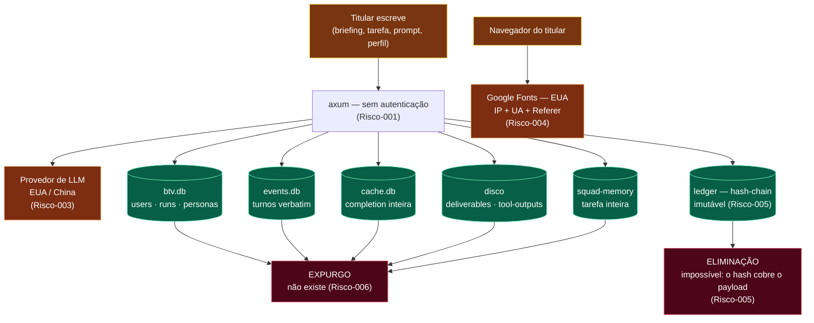

# RIPD — Relatório de Impacto à Proteção de Dados Pessoais

**Sistema:** BuildToValue / `mix_btv_code` — CLI/TUI de agente de código e plataforma de
squads de IA.
**Norma de referência:** Lei 13.709/2018 (LGPD), Art. 5º, XVII e Art. 38.
**Commit auditado:** `a3e14f4`
**Status do documento:** **PENDENTE DE APROVAÇÃO** — ver §8.

**Documento irmão:** o registro técnico dos achados, com `arquivo:linha` e comandos de
evidência, está em
[mapeamentos/09 — Auditoria LGPD](mapeamentos/09-auditoria-lgpd.md). Este RIPD **referencia**
os IDs `Risco-NNN` daquele documento; não os redescreve.

> **Este RIPD documenta um sistema que não está em conformidade.** Ele não afirma
> conformidade — ele mede a distância até ela. Um RIPD que conclui "tudo certo" sobre um
> sistema sem base legal declarada, sem retenção e sem canal do titular seria prova
> documental contra o controlador, não a favor.

---

## 1. Executive summary

### 1.1 O que o sistema faz

O BuildToValue é uma ferramenta de agentes de IA que executa trabalho a pedido do usuário:
sessões de código pelo navegador, squads multi-agente sobre um briefing, biblioteca de
prompts, e um painel administrativo. Roda como processo local que serve um SPA e fala com
provedores de LLM externos.

**Finalidades reais de tratamento identificadas:**

| # | Finalidade | Dado envolvido |
|---|---|---|
| F1 | Executar a tarefa pedida pelo usuário (gerar código, texto, entregas) | conteúdo autoral: tarefa, briefing, prompts, mensagens, trechos de arquivo |
| F2 | Identificar o perfil ativo na interface | `users.nome`, `users.email`, `users.papel` |
| F3 | Proteger a troca de perfil na UI | `users.pin_hash` |
| F4 | Registrar governança e procedência das ações | `ledger.body` (inclui conteúdo autoral) |
| F5 | Medir uso e custo da operação | `telemetry_event` (só modelo e tokens) |
| F6 | Reduzir latência e custo em requisições repetidas | `prompt_cache.response` |
| F7 | Dar memória episódica ao squad | `agent_memories.jsonl` (inclui a tarefa inteira) |

### 1.2 Os dois cenários de implantação

Ambos existem no repositório. Todo risco deste documento declara em qual deles morde.

| | **A — local-first** | **B — hospedado** |
|---|---|---|
| Bind | `127.0.0.1:7878` (default do `--host`) | `--host 0.0.0.0` na bridge do compose, sem porta publicada no host |
| Borda pública | nenhuma | nginx externo com basic auth **compartilhada**, `BTV_TRUSTED_ORIGINS` |
| `BTV_MODE` | ausente → `Mode::Local` | **ausente → `Mode::Local`** (Risco-027) |
| Tenant | `{local}` | `{local}` — **único para todos os titulares** |
| Ator no ledger | `web:btv` | `web:btv` — **idêntico para todos** |
| Disco | máquina do próprio titular | volume em VPS de terceiro |
| Nº de titulares | 1 | N, **sem segregação** |
| Controlador | confunde-se com o titular em uso estritamente pessoal | BuildToValue |
| Operadores / receptores | provedor de LLM; Google (fontes) | idem, mais o provedor de VPS |

O cenário B não é hipótese: o compose está versionado, documentado e nomeia uma origem
pública. É ele que define o veredito deste RIPD.

### 1.3 Veredito

| Cenário | P0 | P1 | P2 | Risco residual global | Apto a receber titular real? |
|---|---|---|---|---|---|
| **A — local-first** | 7 | 9 | 7 | **Médio** | Sim, com as ressalvas de §7 — o titular e o operador se confundem, e o disco é dele |
| **B — hospedado** | 8 | 13 | 9 | **Alto** | **Não, sem tratar os P0** |

Contagem obtida da coluna "Cenário" de cada risco em
[mapeamentos/09](mapeamentos/09-auditoria-lgpd.md). O único P0 exclusivo de B é o
**Risco-027**; os riscos exclusivos de B nos demais níveis são 011, 012, 014, 029 (P1) e
018, 023 (P2).

Os riscos que definem o veredito de B: **Risco-001** (nenhuma autenticação; GET isento do
guard), **Risco-027** (tenant e ator únicos — o produto não sabe quem é o usuário),
**Risco-002** (IDOR por ids sequenciais), **Risco-003** (transferência internacional sem
salvaguarda) e **Risco-005/006/007** (eliminação inexequível, retenção infinita, nenhum
direito atendido).

### 1.4 Papéis

| Papel LGPD | Quem | Observação |
|---|---|---|
| **Controlador** | BuildToValue (cenário B); o próprio usuário (cenário A, uso estritamente pessoal) | Ver a discussão do Art. 4º, I em §3.4 |
| **Operador** | Provedor de VPS (cenário B) | Sem contrato de operador identificado — §4.3 |
| **Receptores no exterior** | Anthropic (EUA), DeepSeek (China), OpenAI (EUA), Google (EUA) | Sem DPA nem SCC — Risco-003, Risco-004 |
| **Encarregado (Art. 41)** | **NÃO NOMEADO** | Risco-030 |

### 1.5 Descope e gatilhos de reavaliação

**Titular considerado:** o usuário da plataforma — seu perfil (A6) e o conteúdo que ele
próprio escreve.

**Fora de escopo, com a consequência escrita:** dados de **terceiros** mencionados dentro
do conteúdo submetido. Se o titular colar no briefing o nome, o CPF ou o histórico clínico
de outra pessoa, **o sistema tratará esse dado sem base legal, o enviará ao exterior, e
este RIPD não o avaliou.** O sistema não tem classificação de dado na ingestão e não pode
distinguir. A mitigação parcial disponível hoje é informar o titular (Risco-020) — não é
controle, é aviso.

**Gatilhos de reavaliação obrigatória deste RIPD:**

1. Uso multiusuário real no cenário B.
2. Campo novo que armazene dado pessoal.
3. Troca, adição ou reordenação de provedor de LLM.
4. Qualquer alteração no que entra no corpo hasheado do ledger.
5. Entrada de dado pessoal sensível (Art. 11) no escopo — o que invalida §2.4 e §3.

---

## 2. Inventário de dados

Fonte do esquema físico: [diagramas/11 — Modelo de dados](diagramas/11-modelo-de-dados.md).
Fonte da classificação de sensibilidade e do fluxo de segredo:
[mapeamentos/08 §8.1-8.2](mapeamentos/08-dados-sensiveis-e-seguranca.md). Este inventário
**acrescenta** as colunas que não existem em nenhum dos dois: finalidade, base legal e
retenção.

**Convenções de preenchimento.** `NÃO DECLARADA` significa que o tratamento existe e a
finalidade nunca foi definida — não é o mesmo que "não se aplica". `INDEFINIDA` significa
retenção infinita de fato. Nenhuma célula fica vazia.

### 2.1 Produto — `.btv/btv.db`

| Campo | Categoria | Origem | Finalidade | Base legal | Retenção atual | Cenário | Risco |
|---|---|---|---|---|---|---|---|
| `users.nome` | identificação direta | digitado na tela A6 | F2 | **AUSENTE** | INDEFINIDA | A, B | 001, 007 |
| `users.email` | identificação direta | digitado (opcional) | **NÃO DECLARADA** — nenhum caminho do sistema consome o e-mail | **AUSENTE** | INDEFINIDA | A, B | 010 |
| `users.papel` | metadado | digitado | F2 (rótulo de exibição; nunca consultado para autorização) | **AUSENTE** | INDEFINIDA | A, B | 001 |
| `users.pin_hash` | credencial | derivado do PIN | F3 | **AUSENTE** | INDEFINIDA | A, B | 009 |
| `users.created_ts` | metadado | servidor | F3 (é o salt do `pin_hash`) | — | INDEFINIDA | A, B | 009 |
| `runs.nome` | conteúdo autoral | digitado no wizard | F1 | **AUSENTE** | INDEFINIDA | A, B | 006 |
| `runs.briefing_json` | **conteúdo autoral denso** | respostas livres do wizard | F1 | **AUSENTE** | INDEFINIDA | A, B | 006, 007 |
| `deliverables.nome`, `.trilha` | conteúdo autoral | gerado a partir do briefing | F1 | **AUSENTE** | INDEFINIDA | A, B | 018 |
| `deliverables.path` + **o arquivo em disco** | conteúdo autoral | ferramenta `edit` | F1 | **AUSENTE** | INDEFINIDA (arquivo nunca removido) | A, B | 006, 007 |
| `persona_overrides.prompt` | conteúdo autoral | digitado na tela de personas | F1 | **AUSENTE** | INDEFINIDA | A, B | 006 |
| `custom_personas.nome`, `.prompt` | conteúdo autoral | digitado | F1 | **AUSENTE** | INDEFINIDA | A, B | 006 |

### 2.2 Ledger — `.btv/btv.db`, tabela `ledger`

`body` é o JSON completo da entrada, e está **dentro do hash da cadeia**. O detalhamento
por variante de evento é o que torna o Risco-005 concreto:

| Variante de `DomainEventKind` / kind | Campo com conteúdo do titular | Finalidade | Base legal | Retenção | Risco |
|---|---|---|---|---|---|
| `session.start` | `payload.task` — **a tarefa inteira, verbatim** | F4 | **AUSENTE** | **IMUTÁVEL por construção** | 005 |
| `AdjustRequested` | `instruction` — texto livre do gate | F4 | **AUSENTE** | IMUTÁVEL | 005 |
| `SquadActivated` | `name`, `refs` (URLs/caminhos livres) | F4 | **AUSENTE** | IMUTÁVEL | 005 |
| `DeliverableProduced` | `name`, `trail` | F4 | **AUSENTE** | IMUTÁVEL | 005 |
| `tool.run` / `tool.result` / `tool.denied` | `scope` (caminhos), `summary` | F4 | **AUSENTE** | IMUTÁVEL | 005 |
| `UserRemoved` | `user_id` (só o id) | F4 | Art. 37 (registro) | IMUTÁVEL | 007 |
| `PersonaUpdated` | **só `prompt_sha256`** | F4 | — | IMUTÁVEL | — (conforme) |
| `user.turn` | **só a contagem de caracteres** | F4 | — | IMUTÁVEL | — (conforme) |
| `actor` (toda entrada) | `web:btv` fixo no modo local | F4 | — | IMUTÁVEL | **027** |

As duas últimas linhas com conteúdo mostram que a disciplina de minimização já existe no
sistema; falta aplicá-la às cinco primeiras.

### 2.3 Demais reservatórios

| Reservatório | Campo | Conteúdo | Finalidade | Base legal | Retenção atual | Cenário | Risco |
|---|---|---|---|---|---|---|---|
| `.btv/events.db` | `event.data` | **cada turno de chat, verbatim** (usuário e assistente) | F1 | **AUSENTE** | INDEFINIDA — sem caminho de exclusão | A, B | 006, 016 |
| `.btv/telemetry.db` | `telemetry_event.props` | só `model` + tokens (§9.5 item 2) | F5 | **AUSENTE** | INDEFINIDA | A, B | 022, 029 |
| `.btv/telemetry.db` | `telemetry_event.session_id` | string literal `"cli"` | F5 | — | INDEFINIDA | A, B | 029 |
| `.btv/cache.db` | `prompt_cache.response` | **a completion inteira do modelo** | F6 | **AUSENTE** | INDEFINIDA — `created_at` gravado, nunca lido | A, B | 006, 029 |
| `.btv/prompt_library.db` | `fields`, `rendered` | tudo que o usuário digitou no gerador + o prompt renderizado | F1 | **AUSENTE** | até o usuário apagar (CRUD, não retenção) | A, B | 006 |
| `.btv/rules.db` | `permission_rules.scope_prefix` | caminho de arquivo / prefixo de comando | F1 | **AUSENTE** | até o usuário revogar | A, B | — |
| `.btv/squad-memory/` | `agent_memories.jsonl` | **o dict de tarefa inteiro** por decisão | F7 | **AUSENTE** | INDEFINIDA — append-only, sem rotação | A, B | 006, 016 |
| `.btv/tool-outputs/` | `*.txt` | saída de ferramenta em overflow | F1 | **AUSENTE** | INDEFINIDA | A, B | 006 |
| `.btv/evidence/` | `<run_id>.json` | evidência de `/verify` | F4 | — | INDEFINIDA | A, B | 006 |
| Postgres (feature `pg`) | `sessions.token_hash` + prazos | credencial hasheada | autenticação | — | TTL 30d absoluto + 24h idle | **nenhum** (exige `BTV_MODE=saas`, não usado) | — (conforme) |
| Navegador | `localStorage` | só `btv_theme` e `btv_accent` | preferência de UI | não é dado pessoal | até o usuário limpar | A, B | — (conforme) |
| Logs (stderr) | — | token de sessão, completions, prompt, tarefa, mensagens entre agentes | operação | **AUSENTE** | efêmero (A) / retido pelo daemon Docker (B) | A, B | 015 |

### 2.4 Classificação

- **Dado pessoal (Art. 5º, I):** `users.nome`, `users.email`, e todo o conteúdo autoral —
  que é dado pessoal por ser produzido por pessoa identificada e revelar sua atividade
  profissional.
- **Dado pessoal sensível (Art. 5º, II):** **nenhum campo do esquema.** Não há biometria,
  saúde, origem racial, convicção religiosa, opinião política, filiação sindical ou dado
  genético coletado.

> **Ressalva que sustenta a classificação acima.** Esse resultado é **por esquema, não por
> conteúdo**. Nada impede o titular de digitar dado sensível num briefing — e o sistema o
> tratará como texto qualquer, o enviará ao exterior e o gravará no ledger imutável. É
> exatamente o descope de §1.5, e é o gatilho nº 5 de reavaliação.

### 2.5 Fluxo de vida do dado



---

## 3. Bases legais

**Regra deste capítulo:** `ADOTADA` exige apontar **onde** a adoção está registrada — tela,
termo, contrato, arquivo. Sem "onde", o status é `AUSENTE`.

### 3.1 Mapeamento finalidade → base legal

| Finalidade | Base legal candidata | Status | Onde está registrada | Consequência se AUSENTE |
|---|---|---|---|---|
| **F1** Executar a tarefa pedida | Art. 7º, V (execução de contrato) — defensável: é literalmente o serviço contratado | **CANDIDATA** | nenhum termo de uso existe | Sem contrato ou termo, não há o que executar. Falta o instrumento, não o fundamento. |
| **F2** Identificar o perfil ativo | Art. 7º, V, quanto a `nome` | **CANDIDATA** para `nome` · **AUSENTE** para `email` | — | O `email` falha o teste de necessidade (Art. 6º, III): nenhuma funcionalidade o consome — Risco-010 |
| **F3** Proteger a troca de perfil | Art. 7º, V | **CANDIDATA** | — | O PIN não é autenticação (Risco-009); apresentá-lo como proteção é problema de transparência |
| **F4** Governança e procedência | Art. 7º, II (obrigação legal, via Art. 37) | **CANDIDATA** | — | Art. 37 justifica registrar *as operações*, **não** armazenar o texto livre do titular de forma imutável — Risco-005 |
| **F5** Medir uso e custo | Art. 7º, IX (legítimo interesse) | **CANDIDATA** | — | Dado é agregado e sem conteúdo (§9.5 item 2); é a finalidade mais fácil de fundamentar — mas exige LIA |
| **F6** Cache de respostas | Art. 7º, IX | **CANDIDATA** | — | Exige LIA e, no cenário B, segregação por tenant — Risco-029 |
| **F7** Memória do squad | Art. 7º, V | **CANDIDATA** | — | Grava a tarefa inteira sem retenção — Risco-006 |
| **Transferência internacional** (F1) | Art. 33 | **AUSENTE** | — | **Nenhuma hipótese do Art. 33 está atendida ou documentada** — Risco-003 |
| **Google Fonts** | — | **AUSENTE** | — | Transferência de IP/UA/Referer sem qualquer base — Risco-004 |

**Nenhuma linha está `ADOTADA`.** Isso não significa que o tratamento seja indefensável —
significa que a defesa nunca foi escrita, e um tratamento cuja base legal não está
documentada é, para efeito de fiscalização, um tratamento sem base legal.

### 3.2 Sobre consentimento

O sistema **não coleta consentimento** para nada, e este RIPD **não recomenda** passar a
coletá-lo como solução geral. Consentimento (Art. 7º, I) é a base mais frágil — revogável
a qualquer momento (Art. 8º, §5º), o que exigiria eliminação em cascata que o sistema hoje
não consegue executar (Risco-005, Risco-007). Para F1–F3 e F7, execução de contrato é
mais adequada e mais honesta.

A exceção é a transferência do Google Fonts, e mesmo ali a recomendação é **eliminar a
transferência** (Risco-004), não pedir consentimento para uma coisa evitável.

### 3.3 Sobre legítimo interesse

Se F5 ou F6 forem fundamentadas em legítimo interesse (Art. 7º, IX), o Art. 10 exige o
teste de balanceamento. **LIA não realizado** — registrar como pendência do controlador.

### 3.4 Sobre o Art. 4º, I

O Art. 4º, I exclui da LGPD o tratamento feito por pessoa natural para fins
exclusivamente particulares e não econômicos. **É um argumento defensável para o cenário
A em uso estritamente pessoal, e não é invocável em nenhum outro caso:**

- não se aplica ao cenário B (múltiplos titulares, controlador organizacional);
- não se aplica a uso profissional no cenário A — e o produto é explicitamente vendido a
  "profissionais não técnicos", o que é fim econômico.

Registrado como **argumento, não como base legal**. Não deve ser usado para dispensar
nenhum dos tratamentos de §3.1.

---

## 4. Medidas de segurança

Os controles existentes estão descritos tecnicamente em
[mapeamentos/08 §8.3](mapeamentos/08-dados-sensiveis-e-seguranca.md) e nos ADRs; aqui
acrescento a qualificação por artigo e por cenário.

### 4.1 Controles técnicos existentes

| Controle | Existe? | Onde | Cenário A | Cenário B | Artigo que endereça |
|---|---|---|---|---|---|
| Bind em loopback por padrão | **SIM** | `main.rs:136-141` | eficaz | **não vale** (`--host 0.0.0.0`) | Art. 46 |
| Guard de `Origin`/`Host` fail-closed | **PARCIAL** | ADR 0015; `guard.rs:22-36` | eficaz contra CSRF | eficaz contra CSRF, **isento em GET** | Art. 46 |
| API keys só em memória do processo | **SIM** | ADR 0001; `gateway.rs:60-95` | eficaz | eficaz | Art. 46 |
| Permissão de ferramenta fail-closed | **SIM** | ADR 0017/0018 | eficaz | eficaz | Art. 46 |
| Sandbox Docker para skill de terceiro | **SIM** | ADR 0011 | eficaz | eficaz | Art. 46 |
| Hash-chain verificável do ledger | **SIM** | `ledger.rs`; `POST /api/ledger/verify` | eficaz | eficaz | Art. 6º, VII (**integridade**) |
| RLS por tenant no Postgres | **SIM** | ADR 0026 | n/a | **não exercido** (tenant único — Risco-027) | Art. 46 |
| `tenant` e `pin_hash` fora do wire | **SIM** | `user.rs:31-36` + teste | eficaz | eficaz | Art. 6º, III |
| Token de sessão só como hash, com TTL | **SIM** | `pg.rs:1054-1070` | n/a | n/a (modo saas não usado) | Art. 46 |
| gitleaks bloqueante no CI | **SIM** | `.github/workflows/ci.yml` | eficaz | eficaz | Art. 46 |

### 4.2 Controles técnicos ausentes

| Controle ausente | Artigo | Cenário | Risco |
|---|---|---|---|
| Autenticação individual | Art. 46; Art. 6º, VII | A (aceito por desenho) / **B (crítico)** | 001 |
| Autorização / checagem de posse | Art. 46 | **B** | 002 |
| Segregação por titular (tenant e ator únicos) | Art. 37; Art. 46 | **B** | 027 |
| Criptografia em repouso | Art. 46 | A, B | 008 |
| Permissão restritiva no diretório `.btv/` | Art. 46 | A, B | 008 |
| KDF para o PIN | Art. 46 | A, B | 009 |
| Rate limit, lockout, timeout, body limit | Art. 46 | **B** | 012, 009 |
| CSP, SRI, `Referrer-Policy` e demais headers | Art. 46; Art. 50 | **B** | 013 |
| Sanitização de erro (hoje devolve erro de SQLite, caminho e panic) | Art. 46 | **B** | 014 |
| Redaction de log | Art. 46 | A, B | 015 |
| Paginação com teto | Art. 6º, III | **B** | 011 |
| TLS no salto nginx → contêiner | Art. 46 | **B** | — |
| Backup com política e restauração testada | Art. 46; Art. 6º, VII | **B** | — |

### 4.3 Controles organizacionais

Todos ausentes. Aparecem em seção própria porque, omitidos, o quadro técnico faz o sistema
parecer melhor do que é.

| Controle | Existe? | Artigo | Risco |
|---|---|---|---|
| Encarregado (DPO) nomeado e publicado | **NÃO** | Art. 41 | 030 |
| Canal de atendimento ao titular | **NÃO** | Art. 18, §1º | 030 |
| Registro das operações de tratamento (ROPA) | **NÃO** — este RIPD §2 é o embrião | Art. 37 | 030 |
| Plano de resposta a incidente e comunicação à ANPD | **NÃO** | Art. 48 | 030 |
| DPA / contrato com os provedores de LLM | **NÃO** | Art. 33; Art. 39 | 003 |
| Contrato de operador com o provedor de VPS | **NÃO** | Art. 39 | — |
| Política de privacidade e termos de uso | **NÃO** | Art. 9º | 020 |
| Gate de privacidade no CI | **NÃO** | Art. 46; Art. 50 | 025 |

---

## 5. Retenção e expurgo

### 5.1 Estado atual

**Não existe retenção no sistema.** Nenhum TTL, nenhum job, nenhum cap, nenhum
`retencao_ate`. A evidência é a ausência:

```sh
grep -rniE "VACUUM|retention|retencao_ate|\bttl\b|expire|purge|prune|older_than" \
  --include=*.rs --include=*.py crates/ python/
# retorna apenas documentação e os deadlines da sessão SaaS
```

| Reservatório | Retenção atual | Mecanismo de expurgo | Bloqueio técnico | Risco |
|---|---|---|---|---|
| `users` | INDEFINIDA | DELETE por CRUD (não é retenção) | — | 007 |
| `runs`, `deliverables`, personas | INDEFINIDA | nenhum | — | 006 |
| Arquivos de entrega em disco | INDEFINIDA | nenhum | — | 006 |
| `ledger` | **IMUTÁVEL** | nenhum, **por desenho** | o hash cobre o payload | **005** |
| `event` / `event_sequence` | INDEFINIDA | nenhum | a compactação de sessão *acrescenta* marco e limpa só a memória | 006 |
| `telemetry_event` | INDEFINIDA | nenhum | — | 006 |
| `prompt_cache` | INDEFINIDA | nenhum (`created_at` gravado, nunca lido) | — | 006 |
| `prompt_library` | até o usuário apagar | CRUD | — | 006 |
| `.btv/tool-outputs/`, `.btv/evidence/` | INDEFINIDA | nenhum | — | 006 |
| `agent_memories.jsonl` | INDEFINIDA | nenhum | append-only sem rotação | 006 |
| `sessions` (PG) | TTL 30d + idle 24h | expiração lógica; a linha nunca é apagada | — | — |

### 5.2 O conflito estrutural: ledger append-only × Art. 16 e Art. 18, VI

O ledger é a única peça onde a retenção não é uma omissão, mas uma **decisão de arquitetura
em conflito direto com a lei**. O ADR 0027 garante integridade por hash-chain; o Art. 18,
VI garante eliminação. Hoje, o primeiro impede o segundo, porque há texto livre do titular
dentro do corpo hasheado (§2.2).

Três caminhos, com o custo de cada um. **Nenhum é implementado por este documento** — é
decisão de ADR:

| Opção | Como funciona | Custo | Preserva a garantia do ADR 0027? |
|---|---|---|---|
| **1. PII fora do corpo hasheado** | O payload guarda um ponteiro; o texto vive num cofre expurgável | Quebra os goldens de corpo; exige migração da cadeia existente | Sim |
| **2. Crypto-shredding** | Texto livre cifrado com chave por titular; a cadeia hasheia o **ciphertext**; eliminar = destruir a chave | Introduz gestão de chaves onde hoje não há nenhuma | **Sim — e é a única que elimina de fato o dado já gravado** |
| **3. Tombstone declarado** | Nova entrada marcando a eliminação; o original permanece | Custo zero de código | Sim, mas **não elimina** — é retificação (Art. 18, III), não eliminação |

**Opção mais barata e imediata, complementar a qualquer uma das três:** parar de colocar
texto livre no ledger daqui para frente. O sistema já sabe fazer isso — `user.turn` grava
só a contagem de caracteres e `PersonaUpdated` grava só o `sha256`. Isso não resolve o
passado, mas estanca o crescimento do problema.

> **Hoje, a resposta do sistema a um pedido de eliminação é parcial e não comprovável.**

### 5.3 Retenção proposta (para decisão do controlador)

O sistema não tem hoje nenhum prazo definido; a tabela abaixo é **proposta**, não estado.

| Reservatório | Proposta | Fundamento |
|---|---|---|
| `telemetry_event` | 90 dias | métrica operacional, sem conteúdo |
| `prompt_cache` | 7 dias | é cache; o valor decai rápido e o conteúdo é denso |
| `event` (turnos de sessão) | pelo tempo de vida da sessão + 30 dias | é conteúdo autoral integral |
| `agent_memories.jsonl` | 90 dias com rotação | memória episódica não precisa ser perpétua |
| `.btv/tool-outputs/`, `.btv/evidence/` | 30 dias | artefato de execução |
| `runs`, `deliverables`, personas | enquanto durar a relação + prazo legal aplicável | é a entrega contratada |
| `users` | enquanto durar a relação | identificação do perfil |
| `ledger` | depende da decisão de §5.2 | — |

---

## 6. Direitos dos titulares

Regra aplicada: **se o direito não tem endpoint com prazo, autenticação e log, ele não
existe no sistema.**

| Art. 18 | Direito | Como é atendido hoje | Atendível? | Prazo praticado | Risco |
|---|---|---|---|---|---|
| **I** | Confirmação da existência de tratamento | não há canal nem endpoint | **NÃO** | — | 030, 007 |
| **II** | Acesso aos dados | `GET /api/btv/users` existe — mas devolve **todos os perfis a qualquer chamador, sem autenticação**. É o oposto de acesso controlado: não é atendimento de direito, é o vazamento | **NÃO** (perverso) | — | 001, 010 |
| **III** | Correção | não há rota de update de `nome`/`email`; só DELETE + recriar, o que gera novo id e quebra a atribuição | **NÃO** | — | **028** |
| **IV** | Anonimização, bloqueio ou eliminação de dado desnecessário/excessivo | nenhum mecanismo | **NÃO** | — | 006 |
| **V** | Portabilidade | `GET /api/btv/deliverables/{id}/download` exporta **artefato**, não o conjunto de dados pessoais do titular | **NÃO** | — | 007 |
| **VI** | Eliminação | `DELETE /api/btv/users/{id}` responde 200 e apaga **só a linha do perfil**. Conteúdo permanece em `runs`, `deliverables`, arquivos em disco, `event`, `ledger`, `cache`, `prompt_library` e JSONL | **NÃO — atendimento ilusório** | — | **005, 007, 016** |
| **VII** | Informação sobre compartilhamento | o titular não é informado de que o conteúdo vai para provedor nos EUA/China, nem de que o navegador contata o Google | **NÃO** | — | 003, 004, 020 |
| **VIII** | Informação sobre a possibilidade de não consentir | não há consentimento coletado | **N/A** | — | — |
| **IX** | Revogação do consentimento | idem | **N/A** | — | — |

| Requisito transversal | Estado |
|---|---|
| Canal de atendimento (Art. 18, §1º) | **AUSENTE** — Risco-030 |
| Prazo de resposta (Art. 19, II — 15 dias) | **sem processo definido** |
| Log de evidência do atendimento | **inexistente**, exceto `btv.user_removed` no ledger |

**Dependência a registrar:** nenhum desses endpoints deve ser construído antes do
Risco-001. Um endpoint de "acesso aos dados" sem autenticação **é** o incidente que deveria
prevenir.

---

## 7. Riscos residuais

Tabela derivada — a descrição de cada risco está em
[mapeamentos/09](mapeamentos/09-auditoria-lgpd.md); aqui está a decisão sobre ele.

| Risco | Sev. | Cenário | Tratamento proposto | Residual após tratamento | Aceito por | Status |
|---|---|---|---|---|---|---|
| **001** sem autenticação | P0 | B crít. / A alto | Completar a E1s (ADR 0029): login, resolver wired, `ROTAS_LIVRES` | Baixo | **PENDENTE** | Aberto |
| **002** IDOR | P0 | B crít. | UUID no `new_task`; `get` em vez de `or_insert_with`; checar posse | Baixo | **PENDENTE** | Aberto |
| **003** transferência internacional | P0 | A, B | Registrar fornecedor, base do Art. 33 e documento; tornar a cadeia explícita | **Médio — permanece** | **PENDENTE** | Aberto |
| **004** Google Fonts | P0 | A, B | Auto-hospedar as fontes | Nenhum | **PENDENTE** | Aberto |
| **005** eliminação × ledger | P0 | A, B | Decidir entre as 3 opções de §5.2, em ADR próprio | **Médio — permanece** | **PENDENTE** | Aberto |
| **006** sem retenção | P0 | A, B | Catálogo → `retencao_ate` na ingestão → job com evidência | Baixo | **PENDENTE** | Aberto |
| **007** direitos do titular | P0 | A, B | Endpoints após Risco-001; eliminação após Risco-005 | Baixo | **PENDENTE** | Aberto |
| **027** tenant e ator únicos | P0 | B | Curto prazo: documentar. Real: depende do Risco-001 | Baixo | **PENDENTE** | Aberto |
| **008** sem cripto em repouso | P1 | A, B | `0o700`/`0o600` agora; cifra de aplicação junto com o Risco-005 | Baixo | **PENDENTE** | Aberto |
| **009** PIN fraco | P1 | A, B | Argon2id + salt próprio + throttle, **ou** deixar de apresentá-lo como proteção | Baixo | **PENDENTE** | Aberto |
| **010** e-mail sem finalidade | P1 | A, B | Remover o campo (minimização vence mascaramento) ou declarar finalidade + DTO | Baixo | **PENDENTE** | Aberto |
| **011** sem paginação | P1 | B | Teto duro; `limit` obrigatório; cursor onde é dado pessoal | Baixo | **PENDENTE** | Aberto |
| **012** sem rate limit | P1 | B | `DefaultBodyLimit` + `TimeoutLayer` agora; por ator após Risco-001 | Baixo | **PENDENTE** | Aberto |
| **013** sem CSP/SRI | P1 | B crít. | Camada de headers após o Risco-004 | Baixo | **PENDENTE** | Aberto |
| **014** erro cru ao cliente | P1 | B | `errorId` na resposta, detalhe no log | Baixo | **PENDENTE** | Aberto |
| **015** log sem redaction | P1 | A, B | `tracing` com ponto único; remover `extra={"decision":...}` já | Baixo | **PENDENTE** | Aberto |
| **016** PII em 6 reservatórios | P1 | A, B | Manter §2 deste RIPD como mapa vivo | Baixo | **PENDENTE** | Aberto |
| **017** append de ledger falha em silêncio | P1 | A, B | Decidir: transacional ou fila de reconciliação | Baixo | **PENDENTE** | Aberto |
| **028** sem rota de correção | P1 | A, B | `PUT /api/btv/users/{id}` com allowlist, registrado no ledger | Nenhum | **PENDENTE** | Aberto |
| **029** cache/telemetria sem tenant | P1 | B | Chave de tenant, ou desligar o cache em multiusuário | Baixo | **PENDENTE** | Aberto |
| **030** sem encarregado/canal/plano | P1 | A, B | Nomear, publicar, escrever o runbook | Baixo | **PENDENTE** | Aberto |
| **018–026** | P2 | vários | ver [mapeamentos/09 §9.4](mapeamentos/09-auditoria-lgpd.md) | Baixo | **PENDENTE** | Aberto |

### 7.1 Riscos que permanecem altos mesmo após tratamento razoável

Dois exigem decisão do controlador, não trabalho de engenharia. Nos termos do **Art. 52**,
são os que expõem a sanção administrativa:

- **Risco-003 — transferência internacional.** Nenhuma correção de código elimina o
  residual: usar LLM de terceiro no exterior é decisão de negócio. O tratamento reduz o
  risco de "sem qualquer salvaguarda" para "salvaguarda documentada", não para zero. Se o
  gatilho nº 5 de §1.5 disparar (dado sensível no escopo), a única resposta suficiente é
  modelo on-premise.
- **Risco-005 — eliminação × ledger.** Qualquer das três opções de §5.2 tem custo alto e
  nenhuma é retroativa sem migração. Enquanto não houver decisão, o sistema **não consegue
  atender ao Art. 18, VI**, e isso deve ser dito ao titular em vez de simulado.

### 7.2 Decisão pendente sobre o cenário B

Este RIPD **não recomenda** operar o cenário B com titulares reais antes de tratar os oito
P0. Se o controlador decidir operá-lo assim mesmo, a decisão precisa ser registrada aqui,
nominalmente e com data — é isso que o Art. 52 vai perguntar.

---

## 8. Aprovação

> **Este bloco entra no repositório em branco, por decisão de método.** Um RIPD assinado
> por antecipação é pior que nenhum RIPD: é prova documental de conformidade fabricada.
> A assinatura só é aposta quando houver decisão real sobre §7.

| Papel | Nome | Assinatura | Data |
|---|---|---|---|
| **Controlador** | _______________________ | _______________________ | ___/___/______ |
| **Encarregado (DPO)** | **NÃO NOMEADO** — Risco-030 | — | — |
| **Revisor de engenharia** | _______________________ | _______________________ | ___/___/______ |

| Campo | Valor |
|---|---|
| **Commit auditado** | `a3e14f4` |
| **Status** | **PENDENTE** |
| **Próxima revisão** | a definir na aprovação |
| **Gatilhos de reavaliação obrigatória** | os cinco de §1.5 |

### Como conferir que este relatório está correto

Todos os achados são reproduzíveis por análise estática. A bateria de comandos está em
[mapeamentos/09 §9.7](mapeamentos/09-auditoria-lgpd.md). Onde a evidência é uma
**ausência**, o comando retorna vazio — e vazio é a confirmação, não um erro de execução.

A verificação só tem valor se for feita por quem não escreveu o documento. Divergência
entre a saída do comando e o que está escrito aqui significa que **o documento está
errado**, não o comando.
