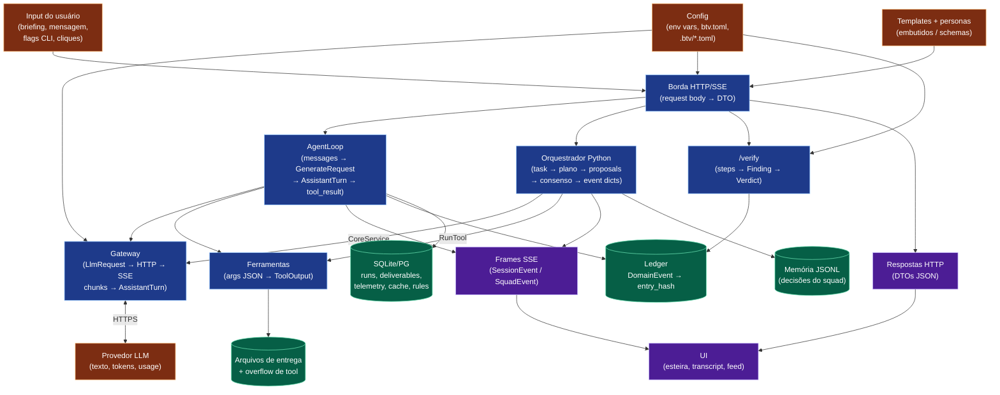

# 00 — Mapa de dados do sistema inteiro

Mapeamento **exaustivo** de todos os dados que circulam no repositório — Rust, Python,
TypeScript e HTML. Para cada módulo estão catalogados os dados de **entrada**, de **saída**
e de **processamento intermediário**, incluindo dados locais que se perdem/são descartados
na própria função ou classe. Fruto de leitura linha-a-linha de todos os scripts.

> Esta é a **Parte III** da documentação. Os diagramas (Parte I) e a referência estrutural
> (Parte II) estão em [`../README.md`](../README.md). Aqui o foco é **o dado em si**: de
> onde vem, o que vira, para onde vai.

---

## Metodologia e legenda

Cada arquivo-fonte tem uma seção com uma tabela no formato:

`| Dado | Tipo | Direção | Origem → Destino | Transformação / observação |`

**Taxonomia de Direção** (usada em todos os documentos desta seção):

| Rótulo | Significado |
|---|---|
| `entrada` | Dado que entra no módulo do exterior: parâmetro de função pública, argumento de CLI, corpo de request HTTP, evento SSE recebido, mensagem gRPC recebida, leitura de disco, variável de ambiente, input do usuário. |
| `saída` | Dado que sai: valor de retorno, resposta HTTP, frame SSE emitido, mensagem gRPC enviada, escrita em disco/DB, evento publicado. |
| `intermediário` | Dado local/transitório de processamento: variável local, buffer, acumulador, valor calculado — **mesmo que descartado** dentro da própria função. |
| `estado` | Dado retido entre chamadas: campo de struct/atributo de instância, estado de hub/context/reducer. |
| `config` | Dado de configuração: constante, variável de ambiente, flag de CLI, arquivo `.toml`. |
| `wire` | Dado que cruza uma fronteira: campo de mensagem gRPC (proto), campo de JSON Schema, coluna de banco, DTO serializado (serde/pydantic/TS), payload SSE. |

---

## Mapa global — a jornada de um dado ponta a ponta

**Leitura do mapa.** Todo dado nasce em um de três lugares (input do usuário, config, ou os
templates/personas embutidos) ou é trazido de fora (o texto do provedor LLM). Ele é
transformado nas camadas de processamento (borda HTTP → AgentLoop / orquestrador → gateway /
ferramentas / verify) e repousa em quatro reservatórios (ledger, SQLite/PG, JSONL, arquivos)
ou volta ao usuário como frame SSE / resposta HTTP. Cada documento 10–17 detalha o dado
dentro de cada módulo dessa jornada.

---

## Reservatórios de dados (onde o dado repousa)

O esquema completo com todas as colunas está em
[`../diagramas/11-modelo-de-dados.md`](../diagramas/11-modelo-de-dados.md). Resumo dos
destinos persistentes:

| Reservatório | Arquivo | Conteúdo |
|---|---|---|
| Produto | `.btv/btv.db` | runs, deliverables, persona_overrides, custom_personas, template_pub, users |
| Ledger | `.btv/btv.db` (tabela `ledger`) | trilha append-only hash-encadeada por tenant |
| Event store | `.btv/events.db` | eventos de sessão com concorrência otimista |
| Telemetria | `.btv/telemetry.db` | telemetry_event, prompt_cache, prompt_library, permission_rules |
| Memória do squad | `.btv/squad-memory/*.jsonl` | decisões episódicas (corpus TF-IDF) |
| Entregas | arquivos no workspace | artefatos gravados pelas ferramentas |
| Overflow de tool | `.btv/tool-outputs/*` | output truncado de ferramenta |
| Sessões SaaS | Postgres (feature `pg`) | tokens de sessão (só hash) |

---

## Dados de configuração global (variáveis de ambiente)

Config é dado de entrada. Catálogo das variáveis lidas pelo sistema (detalhe por módulo nos
docs 10–17):

| Variável | Lida por | Efeito |
|---|---|---|
| `ANTHROPIC_API_KEY` | `btv-llm::Gateway::from_env` | habilita provider Anthropic (1º no fallback) |
| `DEEPSEEK_API_KEY` | idem | habilita DeepSeek (2º) |
| `OPENAI_API_KEY` | idem | habilita OpenAI (3º) |
| `BTV_LLM_CONNECT_TIMEOUT_SECS` | `btv-llm::Gateway` | timeout de conexão (default 30s) |
| `BTV_LLM_READ_TIMEOUT_SECS` | `btv-llm::Gateway` | timeout de leitura idle (default 120s) |
| `BTV_MODE` | `btv-cli::tenant_extractor` | modo local vs SaaS (resolução de tenant) |
| `BTV_TRUSTED_ORIGINS` | `btv-server::guard` | hosts extras permitidos além de localhost |
| `BTV_WEB_DIR` | `btv-server` | diretório do SPA produto (default `btv-web/dist`) |
| `BTV_DEV_WEB_DIR` | `btv-server` | diretório do console dev (default `web/dist`) |
| `BTV_LOADGEN_PORT` | `btv-server::bin/loadgen` | porta do alvo k6 (default 7900) |
| `BTV_PYTHON_DIR` | `btv-cli::sidecar` | localização do workspace Python |
| `BTV_SCRIPTED` | `btv-cli` (web_agent/squad_agent) | usa `ScriptedGenerator` sem key (testes/e2e) |
| `BTV_UPDATE_GOLDEN` / `CI` | `btv-golden` | reescreve fixtures (proibido sob `CI`) |
| `PLAYWRIGHT_BROWSERS_PATH`, `PLAYWRIGHT_SKIP_BROWSER_DOWNLOAD` | e2e | Chromium pré-instalado |

Config de tenant SaaS (feature `pg`): variáveis de conexão do pool Postgres (ADR 0026).

---

## Fronteiras onde o dado muda de forma (`wire`)

| Fronteira | Formato do dado | Contrato |
|---|---|---|
| Navegador ↔ Rust | JSON HTTP + frames SSE | [endpoints](../referencia/14-endpoints-http.md) |
| Rust ↔ Python | mensagens protobuf sobre UDS | [contratos gRPC](../referencia/13-contratos-grpc-e-schemas.md) |
| Rust ↔ Provedor LLM | Anthropic Messages / OpenAI Chat Completions (SSE) | — |
| Rust ↔ Disco | linhas SQL / JSON canônico / JSONL | [modelo de dados](../diagramas/11-modelo-de-dados.md) |
| Rust ⇄ Python (hash) | JSON canônico → sha256 | `prompt-cache-key.v1` (dupla implementação) |

---

## Arquivos desta seção (Parte III — Mapeamento de dados)

| # | Documento | Escopo |
|---|---|---|
| 00 | Este documento | Metodologia, mapa global, reservatórios, config global |
| 10 | [Domínio e contratos Rust](10-rust-dominio-e-contratos.md) | btv-domain, btv-schemas |
| 11 | [Core e gateway Rust](11-rust-core-e-llm.md) | btv-core, btv-llm |
| 12 | [Tools e verify Rust](12-rust-tools-e-verify.md) | btv-tools, btv-verify |
| 13 | [Store, proto e sidecar Rust](13-rust-store-proto-sidecar.md) | btv-store, btv-proto, btv-sidecar |
| 14 | [CLI Rust](14-rust-cli.md) | btv-cli (composition root) |
| 15 | [Server e demais Rust](15-rust-server-e-outros.md) | btv-server, btv-tui, btv-golden, btv-contract |
| 16 | [Python](16-python.md) | os 4 pacotes |
| 17 | [TypeScript e HTML](17-typescript-e-html.md) | web/, btv-web/ |
