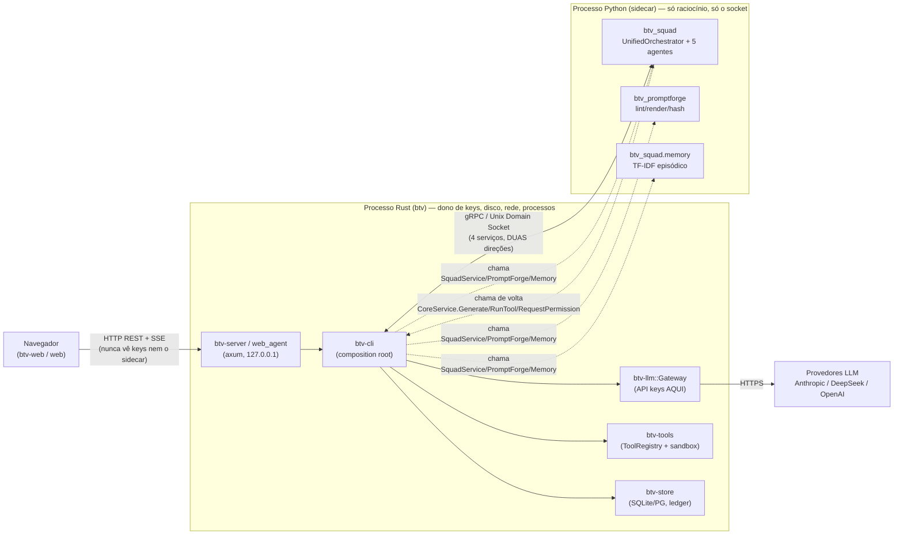

# 01 — Visão geral e fronteiras de sistema

**Objetivo:** situar o leitor no repositório, mostrar a regra de fronteira que rege toda
a arquitetura e enumerar os mecanismos de comunicação entre as três linguagens.

---

## 1.1 Organização do repositório

| Área | Linguagem | Papel |
|---|---|---|
| `crates/` (14 crates, workspace Cargo) | **Rust** | Núcleo: CLI/TUI, gateway LLM, ferramentas, permissões, verify, storage, HTTP, ponte gRPC. **Dono das API keys, disco, rede, processos.** |
| `python/packages/` (4 pacotes, workspace uv) | **Python** | Sidecar de raciocínio: squad multi-agente, PromptForge, review, memória. **Nunca chama LLM direto; nunca toca disco/keys.** |
| `btv-web/` | **TS/React 19** | SPA-produto BuildToValue (raiz `/`) — para profissionais não técnicos. |
| `web/` | **TS/React 19** | Console dev/admin (montado em `/dev`, `base: './'`). |
| `schemas/` | **proto + JSON Schema** | Fonte única de contratos (gRPC, `*.v1.schema.json`, 12 templates, fixtures). |
| `vendor/bpmn` | **TS (submódulo)** | Lib agnóstica `@bpmn-react/*` consumida pelo Squad Designer de `btv-web`. |
| `infra/`, `.github/` | Docker/k6/TF/Ansible + CI | Esqueleto local-first + 13 jobs de CI. |

Os 14 crates: `btv-cli`, `btv-contract`, `btv-core`, `btv-domain`, `btv-golden`,
`btv-llm`, `btv-proto`, `btv-schemas`, `btv-server`, `btv-sidecar`, `btv-store`,
`btv-tools`, `btv-tui`, `btv-verify`.

Os 4 pacotes Python: `btv-promptforge`, `btv-proto-py`, `btv-review`, `btv-squad`.

---

## 1.2 A regra de fronteira (ADR 0001) — o eixo de toda a arquitetura

**A regra (ADR 0001):**
- **Rust**: tudo que toca disco/rede/processo/segredo ou roda a cada keystroke (CLI/TUI,
  sessões, gateway LLM, ferramentas, permissões, verify, storage). **API keys existem só
  no processo Rust.**
- **Python**: tudo que decide o próximo passo por raciocínio de agente (squad,
  PromptForge, review, eval). **Python NUNCA chama provedores LLM diretamente** — sempre
  via `CoreService.Generate` (gRPC).
- **Sem PyO3** no caminho principal (tokio × asyncio); sidecar supervisado com fallback
  progressivo: squad → agente-único → safe-mode read-only.

---

## 1.3 As três fronteiras de comunicação

### Fronteira A — Rust ⇄ Python (gRPC sobre Unix Domain Socket)

Um único socket carrega **4 serviços em duas direções**:

| Serviço | Quem serve | Quem chama | RPCs principais |
|---|---|---|---|
| `CoreService` | **Rust** (`btv-sidecar::CoreServer`) | Python (agentes) | `Generate` (stream), `RunTool`, `RequestPermission`, `AppendLedger`¹, `Recall`¹, `Remember`¹ |
| `SquadService` | **Python** (`SquadServicer`) | Rust (`btv-sidecar`) | `ExecuteTask` → **stream** `SquadEvent`, `Health` |
| `PromptForgeService` | **Python** (`PromptForgeServicer`) | Rust | `Lint`, `Render`, `ListGenerators`, `Health` |
| `MemoryService` | **Python** (`MemoryServicer`) | Rust | `Recall` (TF-IDF), `List`, `Health` |

¹ `AppendLedger`/`Recall`/`Remember` de `CoreService` são stubs `Unimplemented` (direção
errada — superados pelo `MemoryService`). Ver [contratos](../referencia/13-contratos-grpc-e-schemas.md).

**O ponto sutil:** um `SquadService.ExecuteTask` (Rust→Python) roda o orquestrador que,
na MESMA execução, abre o canal de volta `CoreService` (Python→Rust) para gerar texto,
rodar ferramentas e pedir permissão. As keys nunca saem do Rust.

### Fronteira B — Navegador ⇄ Rust (HTTP axum em `127.0.0.1`)

REST + **SSE** (streaming). Toda rota mutável passa por um guard de `Origin`/`Host`
fail-closed (ADR 0015). Duas SPAs servidas pelo mesmo binário: `btv-web` na raiz `/`,
`web` em `/dev`. Ver [endpoints](../referencia/14-endpoints-http.md).

### Fronteira C — Contratos single-source (`schemas/`)

Um único algoritmo tem implementação **dupla** — `prompt-cache-key.v1` em
`crates/btv-schemas/src/canonical.rs` (Rust) ∥
`python/packages/btv-promptforge/src/btv_promptforge/hashing.py` (Python) — com paridade
garantida por `schemas/fixtures/`. Qualquer mudança exige regenerar fixtures e os testes
de paridade dos dois lados devem passar.

---

## 1.4 Dependências externas por linguagem

| Rust (`Cargo.toml`) | Python (`pyproject.toml`) | TypeScript (`package.json`) |
|---|---|---|
| `tokio`, `tonic`/`prost` (gRPC), `axum`/`tower`/`hyper-util` (HTTP), `reqwest` (LLM HTTP), `rusqlite` + `sqlx` (storage), `bollard` (Docker), `rmcp` (MCP), `ratatui`/`crossterm` (TUI), `serde`/`serde_json`/`schemars`, `sha2`/`hex`, `clap`, `uuid`, `criterion` | `grpcio` + `grpcio-tools`, `pydantic>=2`, `pytest` (dev). `docker` SDK é import opcional. TF-IDF/hash são stdlib puro. | `react@19` + `react-dom`, `vite`, `vitest`, `@playwright/test`, `oxlint`. `btv-web` adiciona `@bpmn-react/*` (alias ao submódulo). **Sem router, sem lib de estado, sem axios.** |

**Padrão notável do frontend:** navegação por estado (`screen` num reducer, sem
URL-router), `fetch` nativo + `EventSource` (sem axios), `api/client.ts` idêntico entre
as SPAs (`fetchJson<T>` trata corpos vazios 202/204).
