```mermaid
flowchart TB
    classDef actor fill:#1f2937,stroke:#9ca3af,color:#fff
    classDef uc fill:#0e7490,stroke:#67e8f9,color:#fff

    PROF(["👤 Profissional\nnão técnico"]):::actor
    DEV(["👤 Desenvolvedor\n/ Operador"]):::actor
    ADMIN(["👤 Admin"]):::actor
    LLM(["🌐 Provedor LLM"]):::actor
    DOCKER(["🌐 Docker / MCP / LSP"]):::actor

    UC1(["Ativar squad pela\ngaleria/wizard (U1/U2)"]):::uc
    UC2(["Acompanhar esteira\nao vivo + chat (U3)"]):::uc
    UC3(["Aprovar gate HITL /\npedir ajuste (cockpit)"]):::uc
    UC4(["Baixar entregas\nda Biblioteca (U4)"]):::uc
    UC5(["Desenhar workflow\nno Squad Designer (U5)"]):::uc
    UC6(["Editar personas\n(overrides/custom, U7)"]):::uc

    UC7(["Sessão de código\npelo navegador (SSE)"]):::uc
    UC8(["Resolver permissão\nde ferramenta (HITL)"]):::uc
    UC9(["Rodar squad\nmulti-agente (CLI)"]):::uc
    UC10(["Rodar /verify\n(evidência)"]):::uc
    UC11(["Chat / TUI /\nRun single-shot"]):::uc
    UC12(["Biblioteca de prompts\n(save/render/lint)"]):::uc

    UC13(["Telemetria, custo,\nrate limits"]):::uc
    UC14(["Ledger: ler +\nverificar cadeia"]):::uc
    UC15(["Publicar templates /\ngerir perfis+PIN (A5/A6)"]):::uc
    UC16(["Vetar skills /\nMCP / LSP / sandbox"]):::uc
    UC17(["Relatório A/B\n(experiment.v1)"]):::uc

    PROF --> UC1 & UC2 & UC3 & UC4 & UC5 & UC6
    DEV --> UC7 & UC8 & UC9 & UC10 & UC11 & UC12
    ADMIN --> UC13 & UC14 & UC15 & UC16 & UC17

    UC1 -. include .-> UC10
    UC1 -. include .-> UC9
    UC2 -. extend .-> UC3
    UC5 -. include .-> UC14
    UC9 -. include .-> UC8
    UC7 -. include .-> UC8
    UC16 -. include .-> UC10

    UC9 --> LLM
    UC11 --> LLM
    UC16 --> DOCKER
```

# 02 — Diagrama de Casos de Uso

**Objetivo:** funcionalidades principais do sistema sob a ótica dos atores.
**Escopo:** ambas as SPAs, a CLI/TUI e os sistemas externos (provedores LLM, Docker,
servidores MCP/LSP).

---

---

## Atores

| Ator | Natureza | Interface |
|---|---|---|
| **Profissional não técnico** | Humano | SPA `btv-web` (galeria, wizard, ao vivo, biblioteca, designer, personas) |
| **Desenvolvedor / Operador** | Humano | Console `web` (`/dev`), CLI/TUI (`btv chat`, `btv tui`, `btv run`, `btv squad`, `btv verify`) |
| **Admin** | Humano | Telas admin (A1–A6) de ambas as SPAs |
| **Provedor LLM** | Sistema externo | HTTPS (Anthropic/DeepSeek/OpenAI) via `Gateway` |
| **Docker / MCP / LSP** | Sistema externo | bollard (sandbox), stdio JSON-RPC (tools externas, language servers) |

## Relacionamentos `«include»` / `«extend»`

- **UC1 `«include»` UC10 e UC9** — a ativação da galeria roda `/verify` *antes* de
  disparar (anexa a evidência tipada ao `SquadTask`) e usa o **motor real de squad**
  (`squad_agent::start_squad_task`, compartilhado com `POST /api/squad/run`).
- **UC2 `«extend»` UC3** — o "pedir ajuste" estende o acompanhamento ao vivo: aprovar
  *com* uma instrução injeta contexto no cockpit (negar abortaria a tarefa).
- **UC9 e UC7 `«include»` UC8** — toda execução de ferramenta por um agente inclui o
  pedido de permissão HITL, resolvido no processo Rust (fail-closed).
- **UC5 `«include»` UC14** — salvar um workflow do Designer valida e **grava no ledger**
  (`btv.flow_saved`), nunca finge aplicar ao squad real.
- **UC16 `«include»` UC10** — a vetting de skills reusa a mesma máquina do `/verify`.

## Notas de design

Os casos de uso mapeiam diretamente às "ondas" documentadas no `CLAUDE.md`: U1–U7
(usuário do produto), A1–A6 (admin). A separação de atores é reforçada pelos perfis de
permissão (`BUILD`/`PLAN`/`GENERAL`) e pela ausência de auth no modo local (perfis locais
com PIN, sem login).
