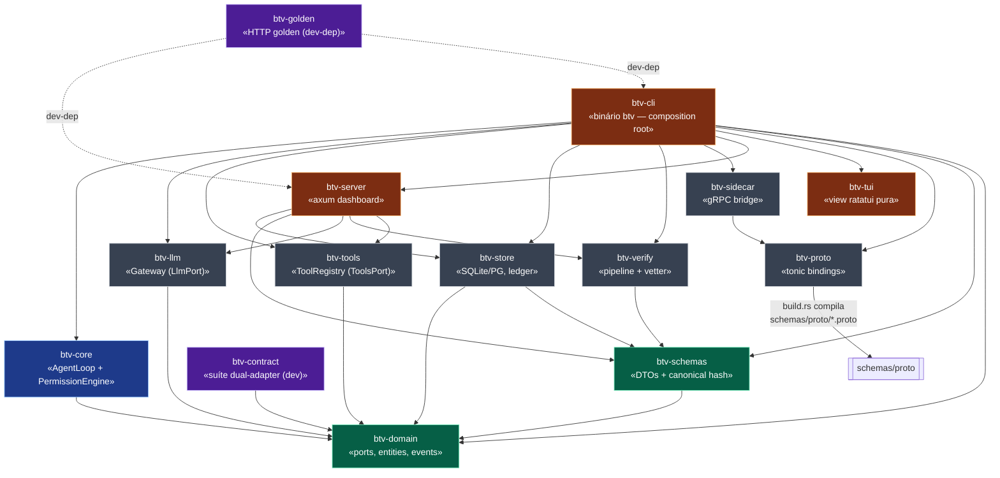
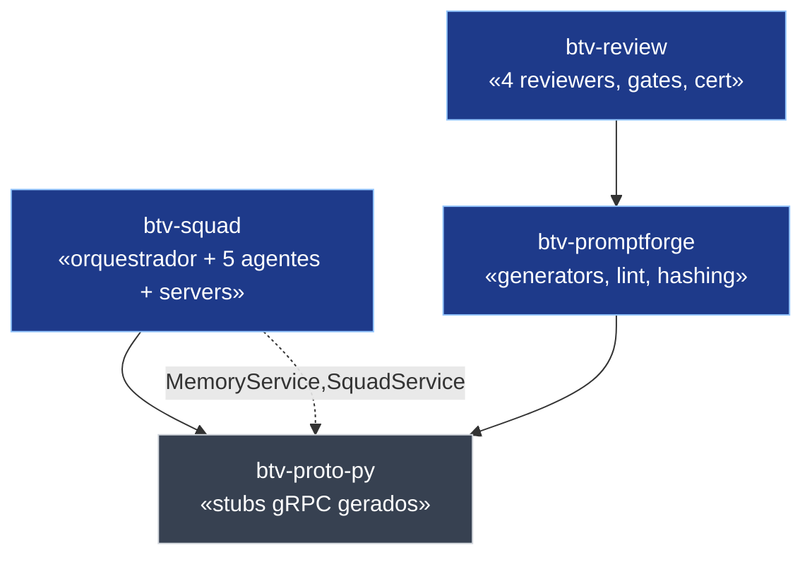
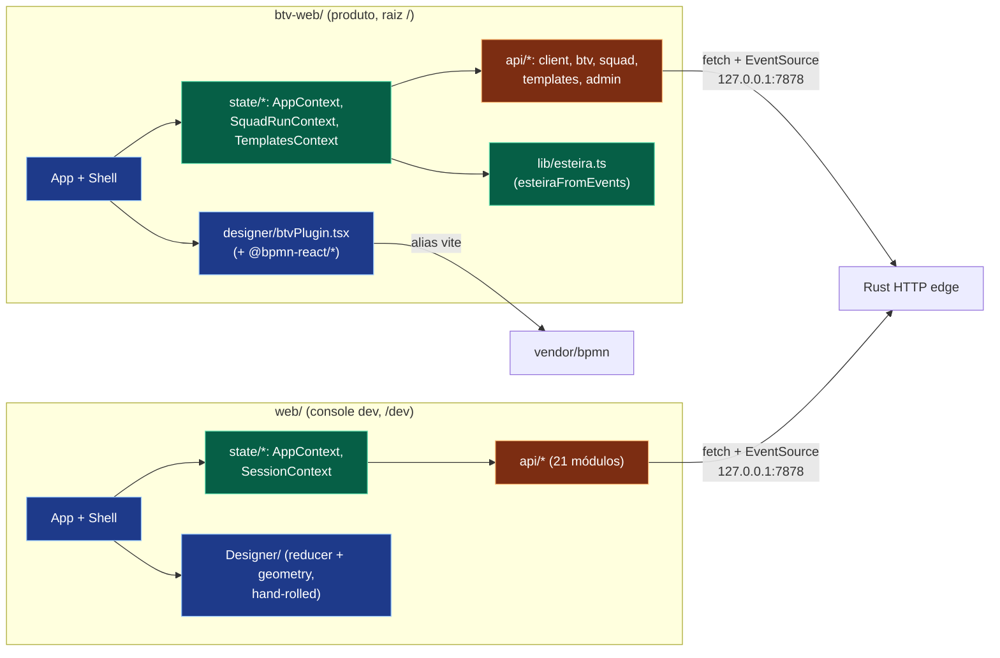

# 03 — Diagrama de Pacotes

**Objetivo:** organização lógica e dependências entre crates Rust, pacotes Python e
módulos TypeScript. Setas = "depende de".

---

## 3.1 Crates Rust (grafo de dependência do workspace)

### Camadas

- **Domínio (verde):** `btv-domain` (ports + agregados + eventos, zero infraestrutura),
  `btv-schemas` (DTOs serializáveis + hash canônico). Núcleo estável.
- **Runtime (azul):** `btv-core` (o loop de agente e o motor de permissões).
- **Infraestrutura (cinza):** adapters e I/O — `btv-llm`, `btv-tools`, `btv-store`,
  `btv-verify`, `btv-proto`, `btv-sidecar`.
- **Borda (laranja):** `btv-server` (axum), `btv-cli` (composition root), `btv-tui`
  (view pura).
- **Teste (roxo, dev-deps):** `btv-golden` (goldens HTTP), `btv-contract` (suíte
  dual-adapter sobre as ports).

### Notas de design

- **`btv-domain` é o núcleo sem infraestrutura** — não depende de rusqlite/axum/tonic/
  reqwest (verificado por máquina no job `arch-lint`). É a raiz de acoplamento aferente.
- **Inversão de dependência**: `btv-core::AgentLoop` conhece só `LlmPort`/`ToolsPort`;
  `Gateway` (btv-llm) e `ToolRegistry` (btv-tools) são adapters injetados por `btv-cli`.
- **`btv-cli` é o composition root** — depende de quase tudo. A dependência corre
  `cli → server` (nunca o contrário), o que força `btv-golden`/`btv-contract` a serem
  dev-deps compartilhadas.
- **Ciclo evitado**: `btv-schemas → btv-domain` (só por `TenantId`); `btv-domain` **não**
  depende de `btv-schemas` (ADR 0027).

---

## 3.2 Pacotes Python (workspace uv)

**Notas.** `btv-proto-py` é o contrato de fio comum (gerado de `schemas/proto/*`, nunca
editado à mão). `btv-review.certification` reusa `btv_promptforge.hashing` (mesmo esquema
canônico do cache-key para `evidence_hash`). A avaliação A/B real vive em Rust
(`btv-schemas::experiment`); o antigo `btv-eval` (placeholder vazio) foi removido (Onda 5, B4).

---

## 3.3 Módulos das SPAs TypeScript

**Notas.** As duas SPAs compartilham o mesmo padrão (Context + reducer, fetch nativo +
EventSource, `api/client.ts` idêntico). A diferença crítica é o Designer: `web/` é board
hand-rolled (reducer + geometria); `btv-web/` é construído sobre `@bpmn-react/*` (submódulo
`vendor/bpmn`) via alias vite + `resolve.dedupe` de react.
