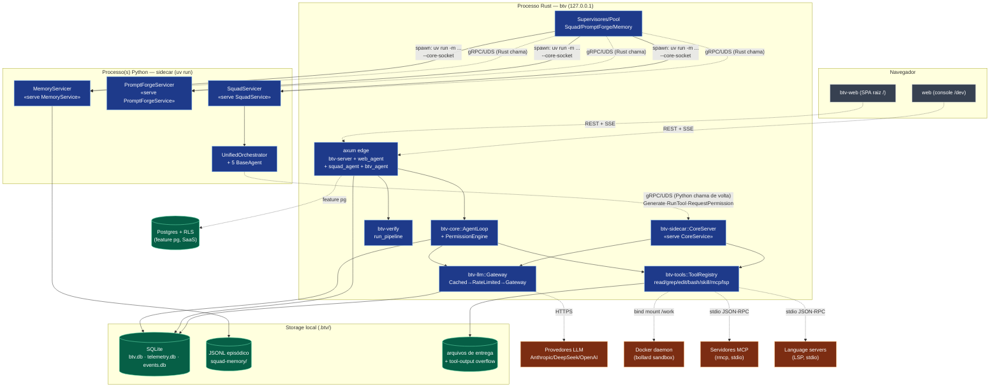

# 04 — Diagrama de Componentes

**Objetivo:** componentes de runtime e suas interfaces de comunicação (HTTP, gRPC,
subprocessos, arquivos).
**Escopo:** processos vivos + storages + serviços externos.

---

---

## Interfaces (contratos de comunicação)

| Origem → Destino | Protocolo | Superfície |
|---|---|---|
| SPA → axum | HTTP REST + **SSE** | `/api/*`; `Origin/Host` guard fail-closed |
| axum → AgentLoop | in-process | `continue_run` (spawn_blocking) |
| Gateway → LLM | HTTPS (SSE) | Anthropic Messages / OpenAI Chat Completions |
| Rust `btv-sidecar` → Python | **gRPC/UDS** | `SquadService.ExecuteTask` (stream), `PromptForgeService`, `MemoryService` |
| Python `UnifiedOrchestrator` → Rust `CoreServer` | **gRPC/UDS** | `CoreService.Generate` (stream), `RunTool`, `RequestPermission` |
| ToolRegistry → Docker/MCP/LSP | bollard / stdio JSON-RPC | sandbox, tools externas, definição/refs/diag |
| tudo → storage | rusqlite / sqlx | `.btv/*.db` (WAL) ou Postgres+RLS |

## Detalhe do transporte UDS

Todos os clientes gRPC usam o mesmo padrão (tonic + hyper-util + tower): um `Endpoint`
com URI-placeholder (`http://sidecar.invalid`) e um `tower::service_fn` que disca um
`tokio::net::UnixStream` embrulhado em `hyper_util::rt::TokioIo`. A conexão é **lazy** — a
primeira RPC é que falha se o socket não estiver pronto (daí o loop de health-check dos
supervisores). O `grpc.default_authority` é ajustado no lado Python porque não há host
real sobre UDS (achado de interop registrado no ADR 0005).

## Ciclo de vida dos processos Python

`btv-sidecar` tem três supervisores (`SquadSupervisor`, `SidecarSupervisor`,
`MemorySupervisor`) que fazem `spawn` de `uv run python -m <módulo> --socket ...`, esperam
o socket + health check, e **matam o grupo de processos inteiro** no drop
(`libc::kill(-pid, SIGKILL)`) — porque `uv run` re-forka o Python e matar só o `uv`
orfanaria o servidor. A camada de serviço de longa duração (ADR 0019) mantém singletons
(`SidecarService`, `MemoryService`) e um pool limitado (`SquadPool`) com restart-on-crash.

## Notas de design

O ponto mais sutil é o **loop bidirecional numa única chamada**: `SquadService.ExecuteTask`
(Rust→Python) roda o orquestrador que, na mesma execução, chama de volta `CoreService`
(Python→Rust) para gerar texto, rodar ferramentas e pedir permissão — as keys nunca saem
do Rust. Fallback progressivo (`SquadRun::Failed` no `drain_stream`): squad → agente-único
→ safe-mode read-only.
