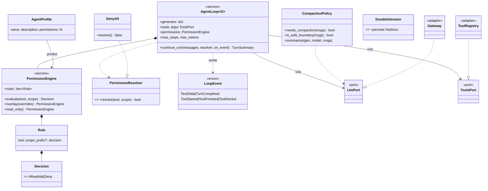
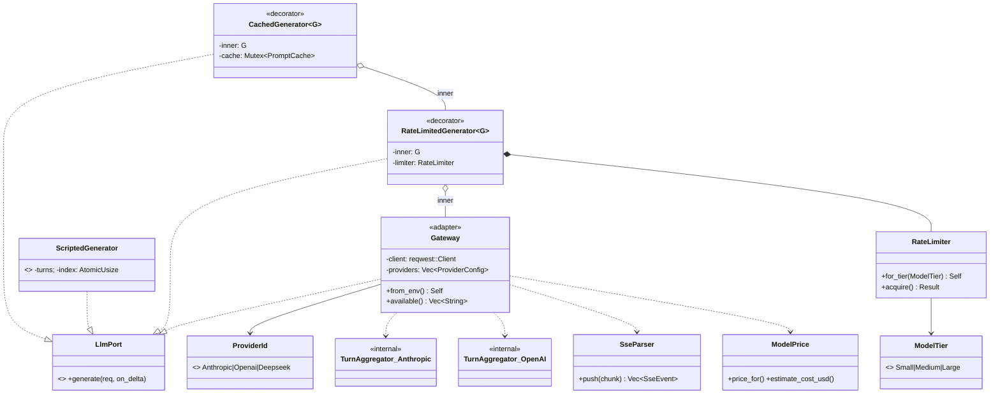
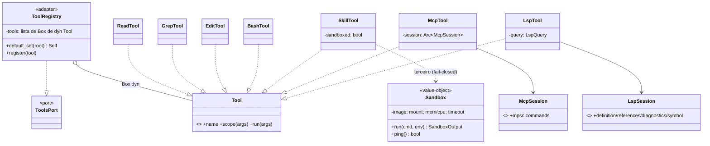
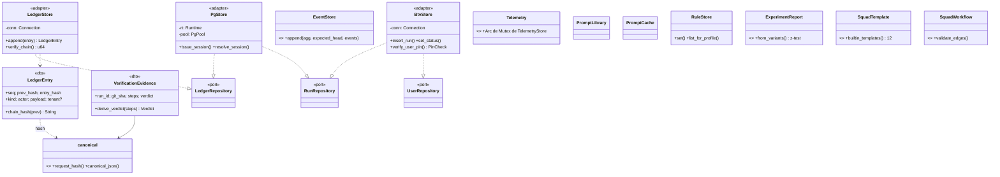

# 05 — Diagrama de Classes

O diagrama de classes é o mais detalhado; por clareza está **quebrado em 7 subdiagramas
por camada**, com referência cruzada. Estereótipos e arquivos de origem anotados. Para o
inventário textual completo (assinaturas de método, campos), ver a
[referência Rust](../referencia/10-rust-crates.md), [Python](../referencia/11-python-pacotes.md)
e [TypeScript](../referencia/12-typescript-frontend.md).

**Legenda:** `«port»` = trait/Protocol/interface · `..|>` realização · `--|>` herança ·
`*--` composição · `o--` agregação · `-->` associação · `..>` dependência.

---

## 5.1 Domínio Rust — ports, agregado e eventos (`btv-domain`)

Fonte: `crates/btv-domain/src/{ports.rs, run.rs, tenant.rs, chat.rs, tool.rs, event.rs, user.rs, ledger_kind.rs}`.

```mermaid
classDiagram
    class LlmPort {
        <<port>>
        +generate(GenerateRequest, on_delta) Future~AssistantTurn~
    }
    class ToolsPort {
        <<port>>
        +specs() Vec~ToolSpec~
        +get(name) Option~&dyn Tool~
    }
    class Tool {
        <<port>>
        +name() str
        +scope(args) String
        +run(args) Result~ToolOutput~
    }
    class RunRepository {
        <<port>>
        +get(ctx, task_id)
        +save(ctx, run)
        +save_with_deliverables(ctx, run, novas)
        +max_task_seq(ctx)
    }
    class LedgerRepository {
        <<port>>
        +append(ctx, DomainEvent) u64
        +verify_chain(ctx) u64
        +export(ctx)
    }
    class PersonaRepository { <<port>> }
    class TemplatePublicationRepository { <<port>> }
    class UserRepository { <<port>> }
    class EventStorePort { <<port>> }

    class Run {
        <<entity>>
        +id: i64
        +task_id: TaskId
        +status: RunStatus
        +gates_aprovados: i64
        +tenant: TenantId
        +activate(ctx, ...) Result~Run~
        +approve_gate(ctx, stage, ts) DomainEvent
        +transition_to(ctx, target, ts)
        +activation_event(ctx, facts, ts) DomainEvent
    }
    class Deliverable {
        <<entity>>
        +id, run_id, task_id
        +nome, path, formato, trilha
        +tenant: TenantId
    }
    class TaskId { <<value-object>> +sq{hex} +parse() }
    class RunStatus {
        <<enum>>
        Ativa|Concluida|Encerrada|Erro
        +can_transition_to(target) bool
    }
    class TenantId { <<value-object>> +LOCAL +parse() }
    class ActorId { <<value-object>> +new() non-empty }
    class TenantContext { <<value-object>> +tenant +actor }
    class DomainEvent {
        <<value-object>>
        +tenant: TenantId
        +actor: ActorId
        +ts: String
        +kind: DomainEventKind
    }
    class DomainEventKind {
        <<enum>>
        SquadActivated|GateApproved
        AdjustRequested|DeliverableProduced
        PersonaUpdated|TemplatePublished
        FlowSaved|UserRemoved
        +wire_kind() str
    }
    class User { <<entity>> +has_pin: bool }
    class PinCheck { <<enum>> NoPin|Ok|Wrong }

    Run *-- TaskId
    Run *-- RunStatus
    Run --> TenantId
    Deliverable --> TaskId
    DomainEvent *-- DomainEventKind
    DomainEvent --> TenantId
    DomainEvent --> ActorId
    TenantContext *-- TenantId
    TenantContext *-- ActorId
    Run ..> DomainEvent : emite
    RunRepository ..> Run
    RunRepository ..> Deliverable
    LedgerRepository ..> DomainEvent
    UserRepository ..> PinCheck
```

**Notas de design.** O **agregado `Run` é a única porta de mutação** — não há
`update_status`/`increment_gates` nas traits; `approve_gate`/`transition_to` validam a
máquina de `RunStatus` e *retornam* o `DomainEvent`. Todo método de todo repositório
recebe `&TenantContext` (tenant fail-closed é erro de compilação). `TenantId`/`ActorId`/
`TaskId` são newtypes opacos sem `Default` — construção só por `parse` validado.
`DomainEventKind` mapeia 1:1 para os kinds `btv.*` do ledger (teste de cobertura
variantes↔fixture).

---

## 5.2 Runtime do agente (`btv-core`) + adapters injetados

Fonte: `crates/btv-core/src/{agent_loop.rs, permission.rs, agent.rs, compaction.rs, session.rs}`.



**Notas de design.** `AgentLoop` é genérico sobre `LlmPort` e mantém `tools: &dyn
ToolsPort` — conhece só as ports do domínio. Ciclo: gerar → `tool_use`? →
`PermissionEngine.evaluate` (`Allow`/`Deny`/`Ask`→`resolver`) → executar → `tool_result`
→ repete até `EndTurn` ou `max_steps`. Perfis `BUILD` (edit/bash sob `Ask`), `PLAN`/
`GENERAL` (read-only). `CompactionPolicy` resume o histórico em fronteira segura (último
turno do assistente sem tool_use pendente), tier-gated (small ~75%, demais ~90%).

---

## 5.3 Gateway LLM e o stack de decorators (`btv-llm` + `btv-cli`)

Fonte: `crates/btv-llm/src/*` + `crates/btv-cli/src/{cache.rs, rate_limit_gen.rs}`.



**Notas de design.** Composição por **decorators genéricos** (valor, não `Box<dyn>` —
despacho monomorfizado): `CachedGenerator<RateLimitedGenerator<Gateway>>`. O **cache é o
mais externo**, então um hit curto-circuita e nunca consome vaga de rate-limit nem token.
Não há trait por provedor: `Gateway::call_provider` despacha por `ProviderId` para dois
transportes internos (`anthropic` = Messages API; `openai` = Chat Completions, cobrindo
OpenAI **e** DeepSeek). Fallback fixo por env: Anthropic → DeepSeek → OpenAI.

---

## 5.4 Ferramentas e contenção de terceiros (`btv-tools`)

Fonte: `crates/btv-tools/src/*`.



**Notas de design.** Todas as ferramentas são `dyn Tool` num `ToolRegistry`. `Tool::run`
é **síncrono**, mas Sandbox (bollard), MCP (rmcp) e Docker são async — três estratégias de
ponte: Skill/Sandbox usa thread dedicada com runtime `current_thread`; MCP usa uma thread
de sessão de longa duração + `mpsc`; LSP é 100% `std::thread` + `Condvar` (zero-dep).
Contenção: `Sandbox` (rootfs read-only, `cap_drop ALL`, `no-new-privileges`, rede off,
mem/cpu limitados) confina skills de terceiro **fail-closed**.

---

## 5.5 Storage, ledger e contratos (`btv-store` + `btv-schemas`)

Fonte: `crates/btv-store/src/*` + `crates/btv-schemas/src/*`.



**Notas de design.** Dois adapters implementam as **mesmas** ports: `LedgerStore`/
`BtvStore`/`EventStore` (SQLite, síncrono) e `PgStore` (Postgres async sob `rt.block_on`,
RLS + `WHERE tenant_id`). A suíte `btv-contract` roda idêntica nos dois — inclusive um
teste **cross-adapter de determinismo de hash** do ledger. O ledger é append-only com
hash-chain **por tenant** (`entry_hash = sha256(prev_hash + corpo canônico)`; tenant entra
no corpo hasheado = anti-transplante). `btv-schemas` é a casa dos DTOs `schemars::JsonSchema`
e do lado Rust do hash `prompt-cache-key.v1`.

---

## 5.6 Squad Python — orquestrador, agentes e subsistemas (`btv_squad`)

Fonte: `python/packages/btv-squad/src/btv_squad/*`.

```mermaid
classDiagram
    class SquadServicer {
        <<service (serve gRPC)>>
        +ExecuteTask(req, ctx) stream SquadEvent
    }
    class MemoryServicer { <<service>> +Recall +List }
    class UnifiedOrchestrator {
        <<service>>
        +execute_complex_task(task, event_sink)
        -_get_squad_proposals()
        -_execute_plan_steps()
        -_attempt_recovery()
    }
    class BaseAgent {
        <<abstract>>
        +agent_type; gateway; memory; persona_prompt
        +execute(task)*
    }
    class ArchitectAgent
    class DeveloperAgent { +implement_task(use_tools) ReAct }
    class AuditorAgent { +validate_results(evidence) }
    class DesignerAgent
    class OpsAgent

    class WeightedConsensusEngine { +reach_consensus(props, type) ConsensusResult }
    class AdaptivePlanner { +create_adaptive_plan() +replan_from_point() }
    class ProgressiveAutonomyManager { <<dataclass>> +execute_with_autonomy() }
    class AgentMemorySystem { +remember_decision() +recall_similar() }
    class LearningRouter { <<dataclass>> }
    class ContinuousEvaluator { <<dataclass>> }
    class ParallelResourceManager { <<dataclass>> }
    class ResilientPromptChain { <<dataclass>> }

    class GatewayClient { <<port/Protocol>> +generate() }
    class PermissionClient { <<port/Protocol>> +request_permission() }
    class ToolClient { <<port/Protocol>> +run_tool() }
    class GrpcGatewayClient { <<adapter>> }
    class GrpcPermissionClient { <<adapter>> }
    class GrpcToolClient { <<adapter>> }

    SquadServicer --> UnifiedOrchestrator : instancia
    SquadServicer ..> GrpcGatewayClient : injeta
    UnifiedOrchestrator *-- AdaptivePlanner
    UnifiedOrchestrator *-- WeightedConsensusEngine
    UnifiedOrchestrator *-- ProgressiveAutonomyManager
    UnifiedOrchestrator *-- AgentMemorySystem
    UnifiedOrchestrator *-- LearningRouter
    UnifiedOrchestrator *-- ContinuousEvaluator
    UnifiedOrchestrator *-- ParallelResourceManager
    UnifiedOrchestrator *-- ResilientPromptChain
    UnifiedOrchestrator o-- BaseAgent : dict de 5
    ArchitectAgent --|> BaseAgent
    DeveloperAgent --|> BaseAgent
    AuditorAgent --|> BaseAgent
    DesignerAgent --|> BaseAgent
    OpsAgent --|> BaseAgent
    BaseAgent --> GatewayClient : self.gateway
    ProgressiveAutonomyManager --> PermissionClient
    DeveloperAgent --> ToolClient
    GrpcGatewayClient ..|> GatewayClient
    GrpcPermissionClient ..|> PermissionClient
    GrpcToolClient ..|> ToolClient
    MemoryServicer *-- AgentMemorySystem
```



**Notas de design (observações específicas de Python).** Os 5 agentes herdam de
`BaseAgent(ABC)` (`@abstractmethod async execute`) e chamam LLM **apenas** via
`self.gateway.generate`. A **injeção por Protocol** (ADR 0005) é o seam: agentes/planner/
autonomy dependem de `GatewayClient`/`PermissionClient`/`ToolClient` (`typing.Protocol`);
em teste entram `Scripted*`, em produção `Grpc*` (`CoreServiceStub`). `pydantic.BaseModel`
modela `Proposal`/`ConsensusResult`/`VerificationEvidence`/`TenantContext` (frozen).
`AuditorAgent` tem um **gate duro** que reprova "completado" sem tool_call mutante
bem-sucedido, *antes* de chamar o gateway. `forgetting.py` foi removido (código morto).

---

## 5.7 Frontend TypeScript — contexts, api clients e DTOs

Fonte: `btv-web/src/*` + `web/src/*`.

```mermaid
classDiagram
    class SquadRunContext {
        <<context/controller>>
        +ativar(template, payload)
        +aprovar() +ajustar(instr)
        +enviarChat() +encerrar()
        -view = esteiraFromEvents(...)
    }
    class TemplatesContext { <<context>> +templates: SquadTemplate[] }
    class AppContext { <<context>> +persona +screen +squad }
    class SessionContext {
        <<context>>
        +sendMessage(msg, opts)
        +resolvePermission(allow)
    }
    class btvApi { <<api>> +ativarSquad +aprovarGate +pedirAjuste +fetchPersonas }
    class squadApi { <<api>> +runSquad +resolveHitl +connectSquadEvents (SSE) }
    class adminApi { <<api>> +fetchLedger +verifyLedger +createUser }
    class streamApi { <<api>> +connectSessionEvents (SSE) }
    class fetchJson { <<helper>> +ApiError }

    class esteiraFromEvents {
        <<pure function>>
        (etapas, events, acoes, streamEnded) EsteiraView
    }
    class btvDesignerPlugin { <<bpmn plugin>> BLOCO_META, NODE_TYPES }

    class SquadEventEnvelope { <<dto: btv_proto::squad>> Proposal|Consensus|Handoff|Hitl|Step|Error|Chat }
    class SessionEvent { <<dto: btv_core::LoopEvent>> text_delta|tool_x|permission_requested }
    class BtvRun { <<dto: btv_store::BtvRun>> }

    SquadRunContext --> squadApi
    SquadRunContext --> btvApi
    SquadRunContext ..> esteiraFromEvents : deriva view
    SquadRunContext ..> SquadEventEnvelope : consome
    SessionContext --> streamApi
    SessionContext ..> SessionEvent : consome
    btvApi ..|> fetchJson
    adminApi ..|> fetchJson
    btvApi ..> BtvRun
    TemplatesContext --> btvApi
```

**Notas de design (observações específicas de TS).** Interfaces que espelham contratos do
backend são anotadas com sua origem Rust (`btv_proto::squad::SquadEvent`,
`btv_core::LoopEvent`, `verification-evidence.v1`) e consumidas como **serde output
direto, sem wrapper de DTO**. O `SquadRunContext` é o controller central da tela ao vivo:
acumula eventos SSE e deriva a UI por `esteiraFromEvents` (função pura que rotula posições
**inferidas** para honestidade). O `btvDesignerPlugin` injeta o vocabulário de domínio na
lib agnóstica `@bpmn-react/*` (a lib nunca menciona "BTV", garantido por
`brand-lint.test.ts`).
