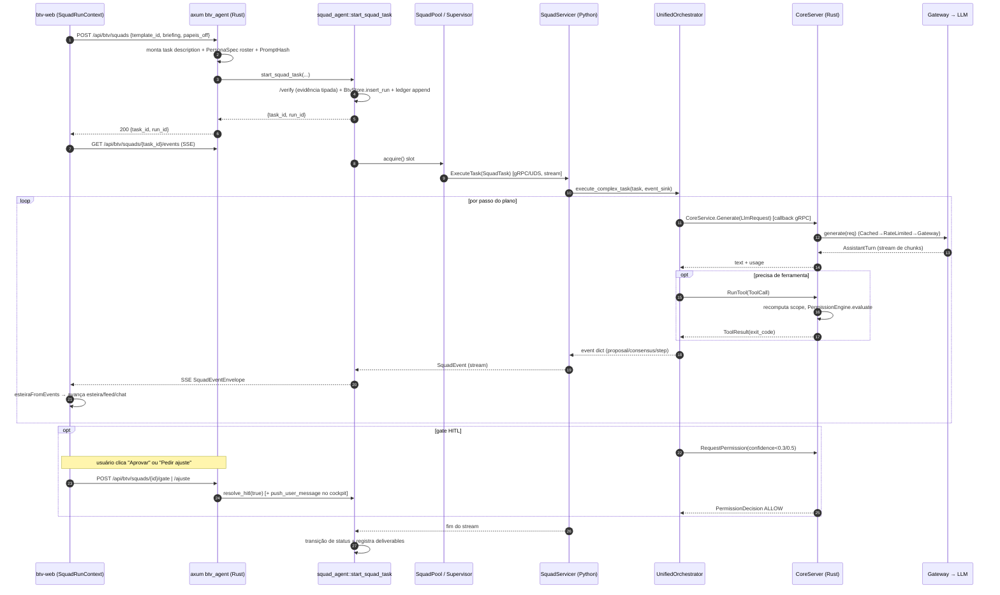
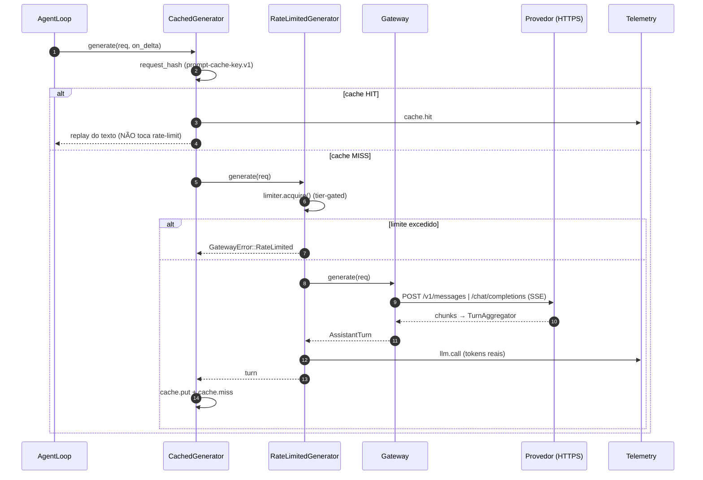
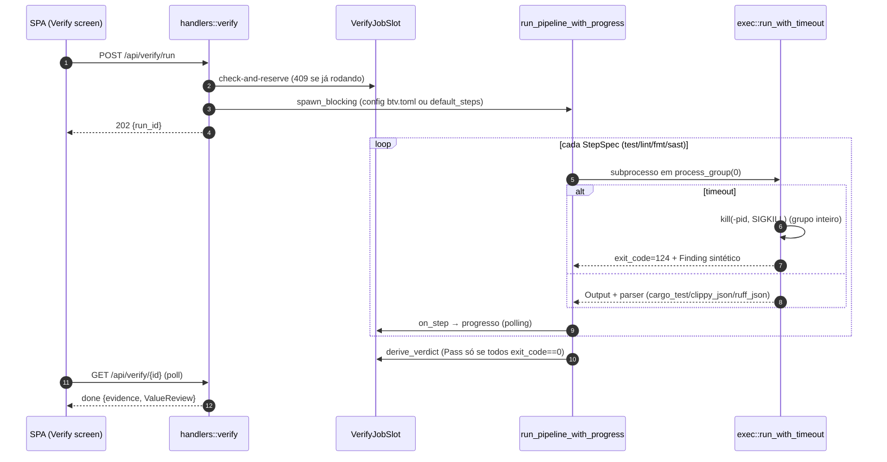

# 06 — Diagramas de Sequência

Cinco fluxos de negócio principais. Para a tabela completa de endpoints, ver
[referência de endpoints](../referencia/14-endpoints-http.md).

---

## 6.1 Ativação de squad pela galeria (o fluxo transversal completo)

**Escopo:** `btv-web` → `btv_agent` (Rust) → motor de squad → orquestrador Python →
callbacks `CoreService` → SSE de volta à esteira. Atravessa **as três linguagens**.



**Notas.** Um único `ExecuteTask` carrega o loop bidirecional inteiro. O "pedir ajuste"
injeta a instrução como turno `user` no próximo `Generate` (cockpit real). A esteira nunca
regride, exceto na regressão visual de 2 passos do ajuste (rotulada `inferida`).

---

## 6.2 Sessão de código pelo navegador com permissão HITL (SSE + fail-closed)

**Escopo:** console `web` → `web_agent` (axum) → `AgentLoop` → `WebPermissionResolver`.

```mermaid
sequenceDiagram
    autonumber
    participant UI as web (SessionContext)
    participant AX as web_agent (axum)
    participant HUB as SessionHub
    participant LOOP as AgentLoop
    participant RES as WebPermissionResolver
    participant TOOL as ToolRegistry

    UI->>AX: GET /api/session/{id}/events (SSE snapshot-then-live)
    UI->>AX: POST /api/session/{id}/message {message, model, agent}
    AX->>HUB: try_start (single-actor, 409 se ocupado)
    AX->>LOOP: continue_run (spawn_blocking)
    loop passos
        LOOP-->>HUB: LoopEvent::TextDelta → publish → SSE
        alt tool_use com Decision::Ask
            LOOP->>RES: resolve(tool, scope)
            RES->>HUB: request_permission (bloqueia em mpsc)
            HUB-->>UI: SSE PermissionRequested
            UI->>AX: POST /api/session/{id}/permission {request_id, allow}
            AX->>HUB: resolve_permission
            HUB-->>RES: allow/deny (ou timeout → Deny fail-closed)
        end
        RES-->>LOOP: bool
        LOOP->>TOOL: run(args) se permitido
        LOOP-->>HUB: ToolFinished/ToolDenied → SSE
    end
    LOOP->>AX: dual-persist (ledger + DurableSession)
    HUB-->>UI: SSE Done
```

**Notas.** Permissão sobre a rede é **fail-closed** (ADR 0017): expira → `Deny`. O
`SessionHub` garante ator único (ADR 0018) e faz replay snapshot-então-live (ADR 0016).
Toda mutação de matriz de permissão é auditada no ledger como override marcado.

---

## 6.3 Geração LLM através do stack de decorators (cache × rate-limit)



**Notas.** A ordem dos decorators garante que um hit de cache nunca consuma vaga de
rate-limit nem token (o cache é o mais externo).

---

## 6.4 Pipeline `/verify` determinístico (job em background)



**Notas.** O kill de **grupo de processos** (`SIGKILL` em `-pid`) resolve a lição da Fase
4d: `uv run`/`cargo` re-forkam, e matar só o filho direto orfanaria netos. A mesma máquina
alimenta o skill-vetter (`Vet`/`Block`).

---

## 6.5 Append no ledger com hash-chain por tenant

```mermaid
sequenceDiagram
    autonumber
    participant APP as Serviço (squad/designer/session)
    participant LR as LedgerStore (LedgerRepository)
    participant DB as SQLite (WAL)

    APP->>LR: append(ctx, DomainEvent)
    LR->>DB: BEGIN IMMEDIATE (pega write-lock antes de ler)
    LR->>DB: SELECT topo da cadeia DO TENANT (seq, entry_hash)
    LR->>LR: prev_hash = topo; entry_hash = chain_hash(prev + corpo canônico)
    Note over LR: tenant entra no corpo hasheado (anti-transplante)
    LR->>DB: INSERT (tenant_id, seq+1, prev_hash, entry_hash, body)
    LR->>DB: COMMIT
    LR-->>APP: seq
```

**Notas.** `TransactionBehavior::Immediate` pega o write-lock **antes** de ler o topo da
cadeia, tornando o read-modify-write atômico entre conexões concorrentes (CLI/squad vs.
dashboard). Nunca há UPDATE/DELETE — overrides são novas entradas marcadas. No adapter
Postgres (`PgStore`) o mesmo append usa retry otimista sobre `UNIQUE(tenant_id, seq)`.
