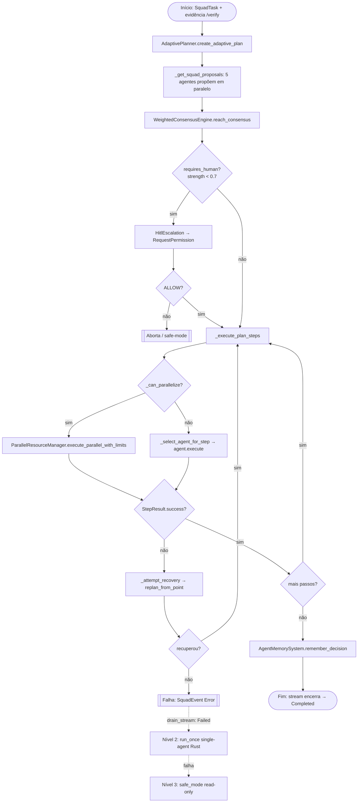
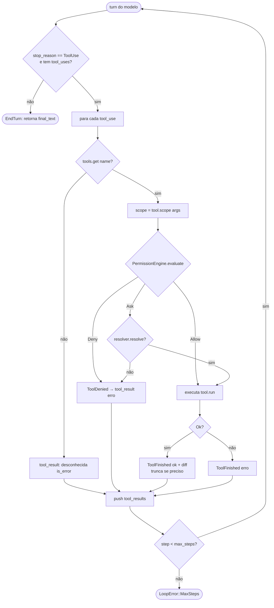

# 07 — Diagramas de Atividades

Os dois workflows genuinamente concorrentes / com múltiplos caminhos do sistema.

---

## 7.1 Orquestração do squad com consenso, HITL e fallback progressivo

**Escopo:** `UnifiedOrchestrator.execute_complex_task` (Python) + a degradação de 3 níveis
do lado Rust (`drain_stream` → `SquadRun::Failed`).

**Notas.** O consenso é ponderado por expertise (`DEFAULT_AGENT_WEIGHTS`); `requires_human`
é `@property` (strength < `HITL_ESCALATION_THRESHOLD = 0.7`). Passos independentes rodam
em paralelo sob semáforo. O `_attempt_recovery` fecha o ciclo de replanejamento adaptativo.
A degradação de 3 níveis (squad → agente-único → safe-mode) é decidida no Rust pelo
`drain_stream`: um `SquadEvent::Error` in-band ou um `Err(Status)` de transporte (ex.:
Python morto por `kill -9`) vira `SquadRun::Failed`.

---

## 7.2 Ciclo de execução de ferramenta sob permissões (AgentLoop)

**Escopo:** `btv-core::AgentLoop::continue_run` + `run_tool`.

**Notas.** O `scope` é **sempre recomputado** de `args` via `Tool::scope` — o campo `scope`
do wire nunca é a fonte de verdade para `Allow`/`Ask`/`Deny` (defesa contra um sidecar
comprometido). Output truncado ganha uma nota com o caminho do arquivo gerenciado antes de
voltar ao modelo.

---

## Justificativa das ausências

Não há diagrama de atividades para outros fluxos porque eles ou são lineares (não têm
ramificação/paralelismo significativo — ex.: `/verify` já está no [diagrama de
sequência 6.4](06-sequencia.md#64-pipeline-verify-determinístico-job-em-background) com sua
única decisão de timeout), ou são puramente request/response (CRUD de personas, templates,
usuários). Os dois workflows acima concentram toda a concorrência (paralelismo de passos,
consenso, HITL, recuperação, fallback) e os múltiplos caminhos de decisão do sistema.
