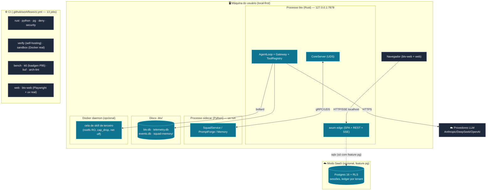

# 08 — Diagrama de Implantação

**Escopo:** modo local-first (padrão) + modo SaaS opcional (`feature pg`) + o esqueleto de
infra e os jobs de CI.

---

---

## Nós e artefatos

| Nó | Artefatos | Rede/protocolo |
|---|---|---|
| Máquina do usuário | Processo `btv` (Rust) + sidecar Python + `.btv/*.db` | tudo em `127.0.0.1`; UDS entre os processos |
| Docker daemon (opcional) | Cela de skill de terceiro (bind mount `/work`) | rede desabilitada dentro da cela |
| Provedores LLM | — | HTTPS de saída (só do Rust) |
| Postgres (SaaS opcional) | Ledger + sessões por tenant, RLS | TCP (só com `feature pg`) |

## Os 13 jobs de CI (`.github/workflows/ci.yml`)

| Job | O que faz |
|---|---|
| `rust` | `cargo test`/`clippy -D warnings`/`fmt` + `uv sync` (para o teste cross-process do sidecar) |
| `arch-lint` | `scripts/arch-lint.sh`: `btv-domain` não pode depender de rusqlite/axum/tonic/reqwest; handlers HTTP sem SQL cru |
| `buf` (PR) | `buf breaking schemas/proto` contra a base do PR (regra aditivo-only) |
| `pg` | Postgres 16 em container; `cargo test -p btv-store --features pg` (RLS adversarial + append concorrente) |
| `deny` | `cargo-deny` (advisories/licenças) |
| `python` | `uv sync` + `pytest` |
| `security` | `gitleaks` (bloqueante) |
| `verify` | Self-hosting: `btv verify` sobre o próprio workspace, sobe artefato de evidência, falha em veredito `Fail` |
| `sandbox` | Integração pesada de `btv-tools` `--include-ignored`: contenção Docker real (4 vetores) + rust-analyzer LSP real |
| `bench` | Benches criterion executados de verdade (btv-schemas/canonical, btv-core/compaction, btv-llm/gateway) |
| `k6` | Sobe o `loadgen` (ScriptedGenerator, sem key) e valida P95 (`p(95)<100`) |
| `web` | Console `/dev`: `pnpm test` + build + Playwright e2e-integration (dashboard real + sidecar Python via uv) |
| `btv-web` | SPA-produto (checkout com **submódulos** para `vendor/bpmn`): vitest + build + Playwright e2e + e2e-integration |

## `infra/` — esqueleto honesto

Local-first, **sem alvo de deploy real**:
- `infra/k6/gateway_load.js` — o **único** artefato executado de verdade (P95 do gateway).
- `infra/terraform/main.tf`, `infra/ansible/playbook.yml` — marcados como esqueleto.
- `infra/docker/Dockerfile` + `docker-compose*.yml` — imagem de teste/homolog empacotando
  o CLI `btv` + sidecar Python (dashboard ainda bind em `127.0.0.1`). **Não** é deploy
  multiusuário na internet.

## Notas de design

O dashboard sempre bind em `127.0.0.1` (local-first, ADR 0015). O modo SaaS não é um fork:
os **mesmos traits** do domínio têm o adapter `PgStore` atrás da feature `pg`, com RLS por
tenant (ADR 0026). A suíte `btv-contract` prova que SQLite e Postgres produzem o mesmo
comportamento — inclusive determinismo criptográfico do hash-chain.
