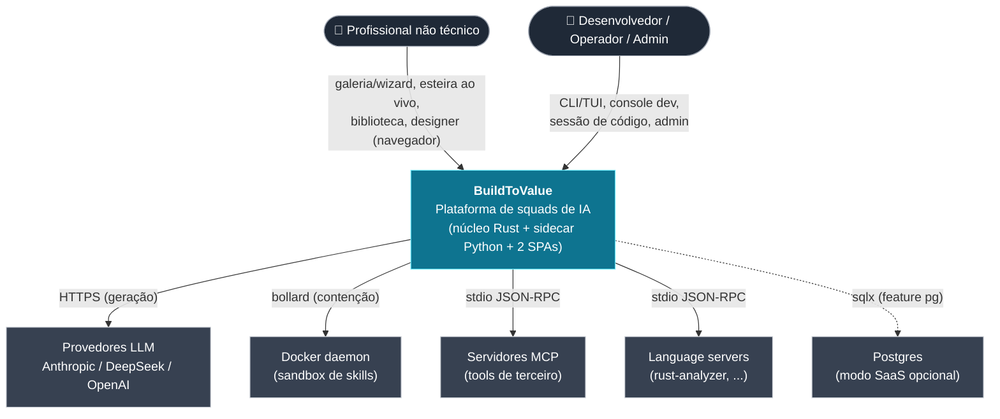
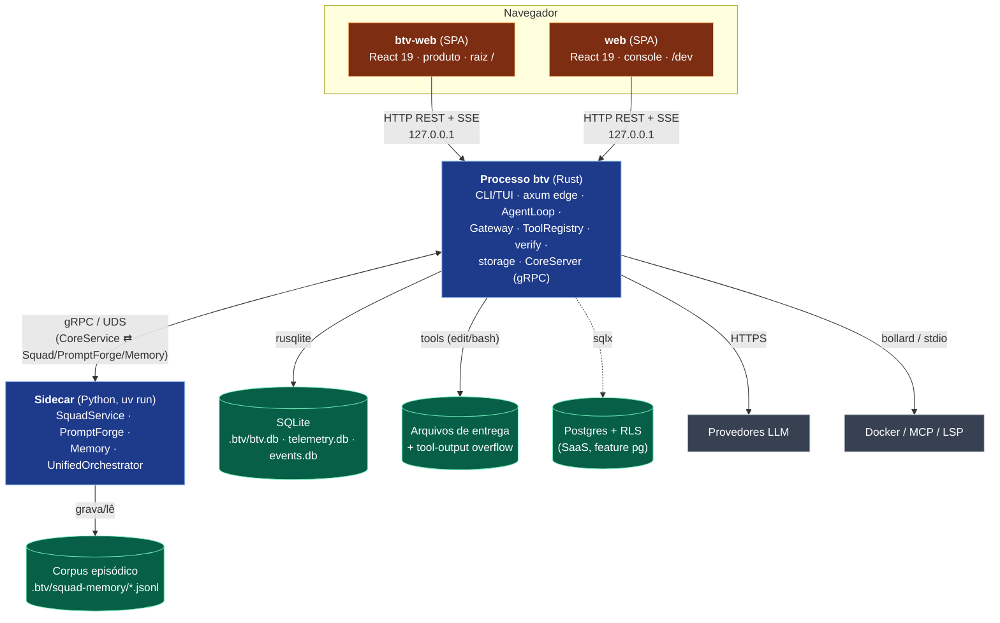
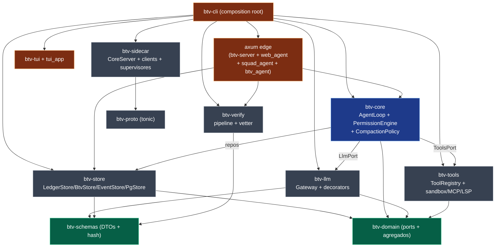
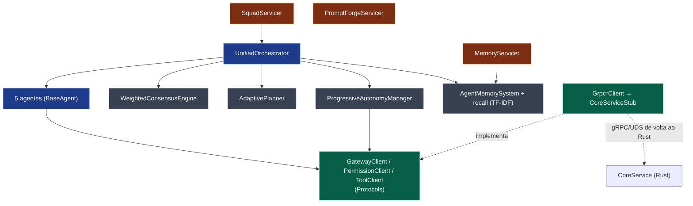
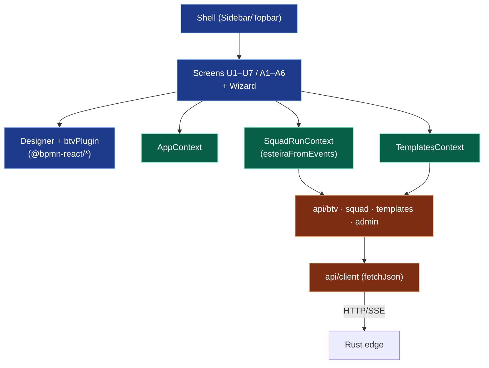

# 10 — Modelo C4 (Contexto → Contêiner → Componente)

O [modelo C4](https://c4model.com) dá a visão de arquitetura em níveis de zoom. Aqui os
quatro níveis; o **Nível 4 (Código)** é o [diagrama de classes](05-classes.md). Usa-se
flowchart (renderização robusta no GitHub) em vez da sintaxe C4 experimental.

---

## C4 — Nível 1: Contexto do sistema

Quem usa o BuildToValue e com que sistemas externos ele fala.

**Notas.** Um único sistema de software com duas classes de usuário. As saídas de rede
(LLM/MCP/LSP/Docker) partem **só** do processo Rust; o navegador nunca alcança nenhum
sistema externo diretamente.

---

## C4 — Nível 2: Contêineres

As unidades executáveis/implantáveis e os armazenamentos.

**Notas.** Dois contêineres de processo (Rust, Python) + duas SPAs (contêineres de
navegador) + armazenamentos locais. O SaaS acrescenta só o Postgres — **sem** novo
contêiner de aplicação (mesmos traits, outro adapter).

---

## C4 — Nível 3: Componentes do contêiner Rust (`btv`)

Zoom no processo Rust: os crates como componentes e suas ligações.

---

## C4 — Nível 3: Componentes do contêiner Python (sidecar)

---

## C4 — Nível 3: Componentes de uma SPA (`btv-web`)

**Nota.** O contêiner `web` (console `/dev`) tem estrutura análoga, trocando
`SquadRunContext`+bpmn por `SessionContext`+Designer hand-rolled e ~22 módulos `api/*`.

---

## Nível 4 — Código

O detalhamento de classes/structs/traits está no
[diagrama de classes (05)](05-classes.md), com o inventário textual completo na
[referência Rust (10)](../referencia/10-rust-crates.md),
[Python (11)](../referencia/11-python-pacotes.md) e
[TypeScript (12)](../referencia/12-typescript-frontend.md).
