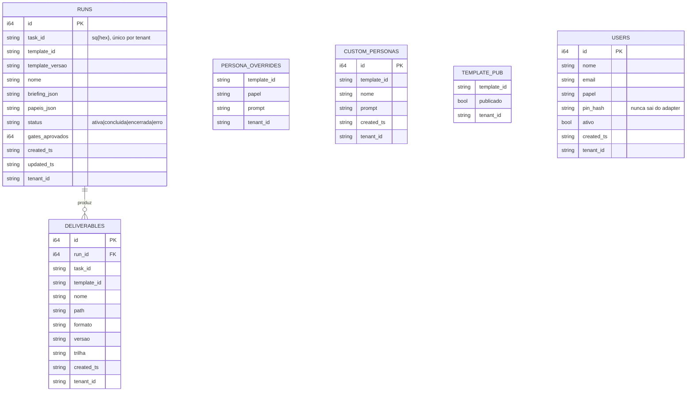
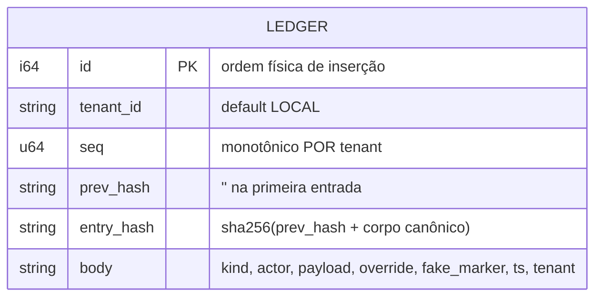
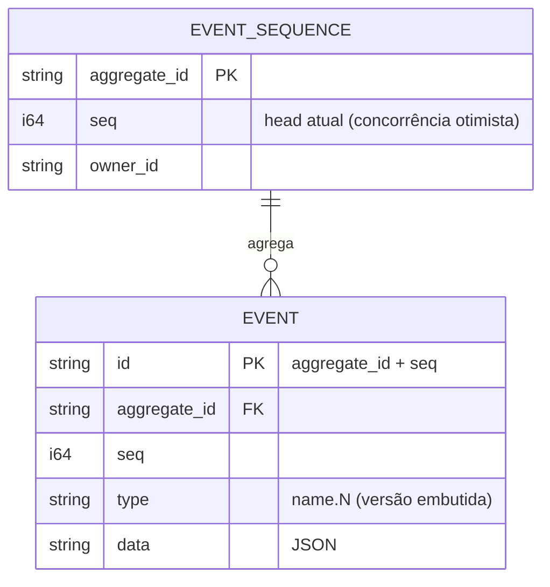
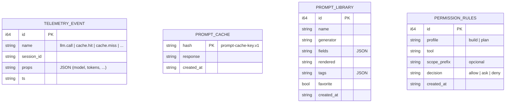
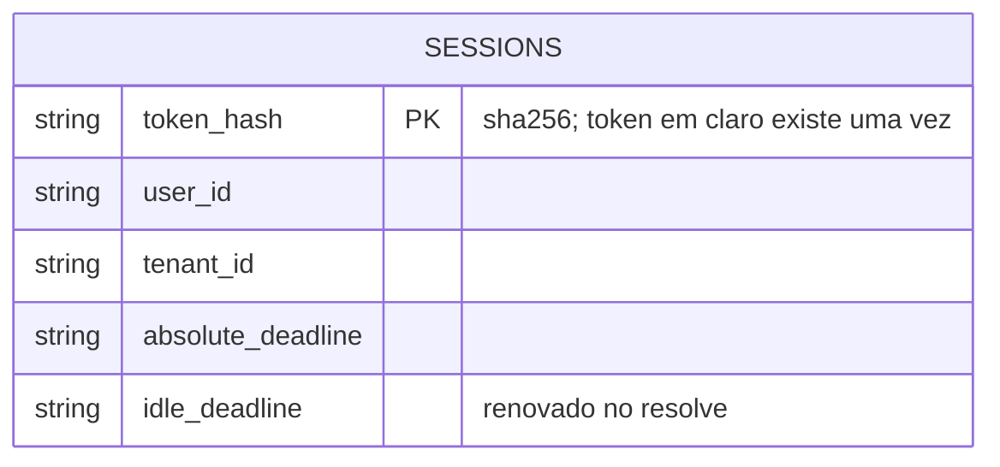

# 11 — Modelo de dados (Entidade-Relacionamento)

O esquema de persistência. Fonte: `crates/btv-store/src/*`. Todas as tabelas de produto
carregam `tenant_id` (default `LOCAL`, ADR 0025). SQLite local por padrão; o mesmo esquema
lógico no Postgres (feature `pg`) com RLS por tenant.

Contratos serializados correspondentes: [`ledger-entry.v1`, `telemetry-event.v1`](../referencia/13-contratos-grpc-e-schemas.md#132-json-schemas-schemasjsonv1schemajson).

---

## 11.1 Produto BuildToValue (`.btv/btv.db` — `BtvStore`)

**Notas.** `RUNS`→`DELIVERABLES` é a única relação forte (entrega só existe sob um run), e
`RunRepository::save_with_deliverables` é a **unidade transacional** (run+entregas commitam
juntos). `PERSONA_OVERRIDES`/`CUSTOM_PERSONAS`/`TEMPLATE_PUB` são chaveadas por
`template_id` (os templates em si são estáticos, embutidos no binário). `USERS.pin_hash`
nunca cruza a fronteira — `verify_pin` compara dentro do adapter e devolve `PinCheck`.

---

## 11.2 Ledger append-only (`.btv/btv.db` — `LedgerStore`)

**Chave lógica:** `(tenant_id, seq)` `UNIQUE`. Nunca há `UPDATE`/`DELETE` — overrides são
novas entradas com `override.marked=true`. O `tenant` entra no **corpo hasheado**
(anti-transplante: reatribuir a outro tenant quebra `entry_hash`). `verify_chain` recomputa
a cadeia por tenant. No Postgres, o append usa retry otimista sobre `UNIQUE(tenant_id, seq)`
(ADR 0028) e as funções de DTO/verificação são **compartilhadas** com o SQLite → paridade
criptográfica (provada por `btv-contract`).

---

## 11.3 Event store de sessão (`.btv/events.db` — `EventStore`)

**Notas.** `append(aggregate_id, expected_head, events)` falha com `ConcurrencyConflict` se
`expected_head` divergir do `seq` atual. Adapter **LOCAL-only** (fail-closed em tenant
não-LOCAL — o esquema não tem coluna de tenant; sessões SaaS nascem no Postgres).

---

## 11.4 Telemetria, cache e biblioteca (`.btv/telemetry.db` e afins)

**Notas.** `TELEMETRY_EVENT` alimenta o dashboard (summary/model_usage) e o relatório A/B
(`experiment_variants` agrega por `props.experiment`). `PROMPT_CACHE` é chaveado pelo hash
canônico (o cache do decorator externo). `PERMISSION_RULES` são os overrides persistidos
que o `PermissionEngine.overlay` aplica por cima do perfil.

---

## 11.5 Sessões SaaS (Postgres — `PgStore`, feature `pg`)

**Notas.** Tabela **exclusiva do modo SaaS** (LOCAL não tem sessões, por isso não há
`SessionsPort` nem análogo SQLite). Token = 256-bit CSPRNG → base64url com prefixo `btvs_`;
só o `token_hash` é gravado. `resolve_session` valida-e-renova o idle deadline numa única
query, fail-closed para `None`.

---

## Visão consolidada — quem escreve o quê

| Tabela | Escritores | Contrato |
|---|---|---|
| `runs` / `deliverables` | `btv_agent` (ativação), `squad_agent` (status/entregas) | agregado `Run`/`Deliverable` |
| `ledger` | squad, designer, sessão, permissão | `DomainEvent` → `ledger-entry.v1` |
| `event` | `DurableSession` (sessão de código) | `EventInput`/`StoredEvent` |
| `telemetry_event` | decorators do gateway, dashboard | `telemetry-event.v1` |
| `prompt_cache` | `CachedGenerator` | `prompt-cache-key.v1` |
| `permission_rules` | matriz de permissão (web) | `Rule` |
| `sessions` (PG) | `issue_session` (operador SaaS) | — |
