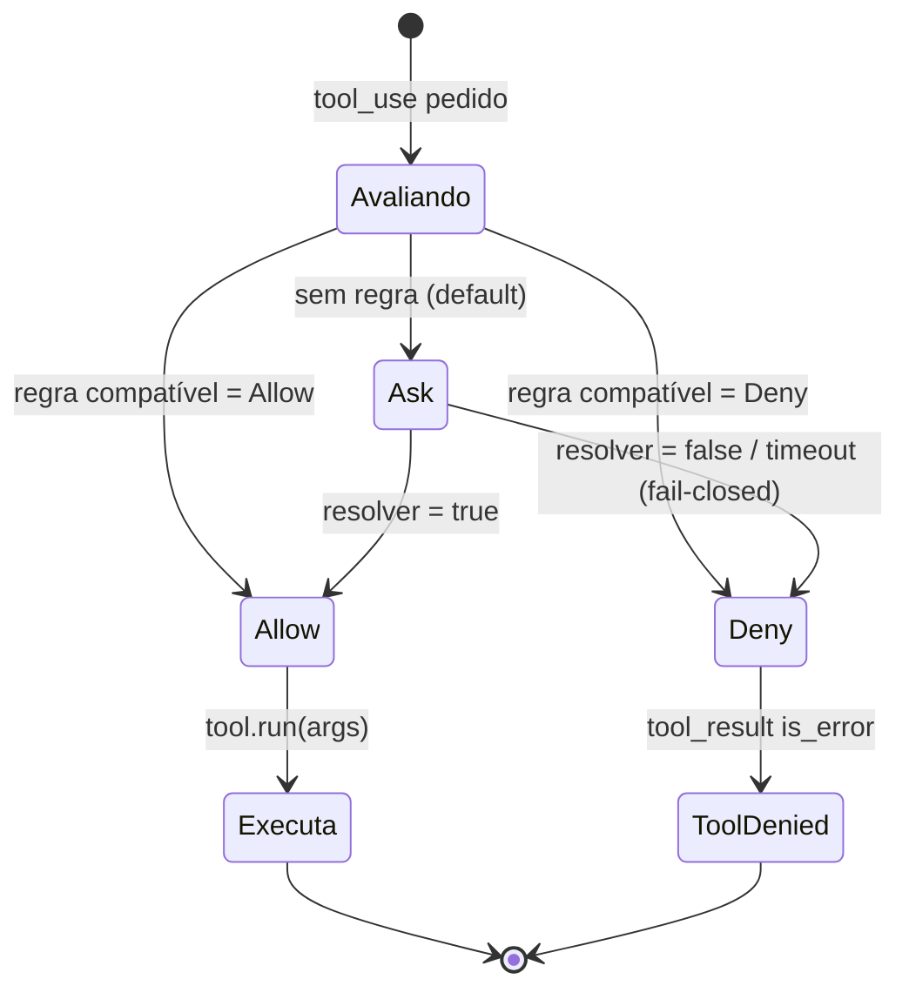
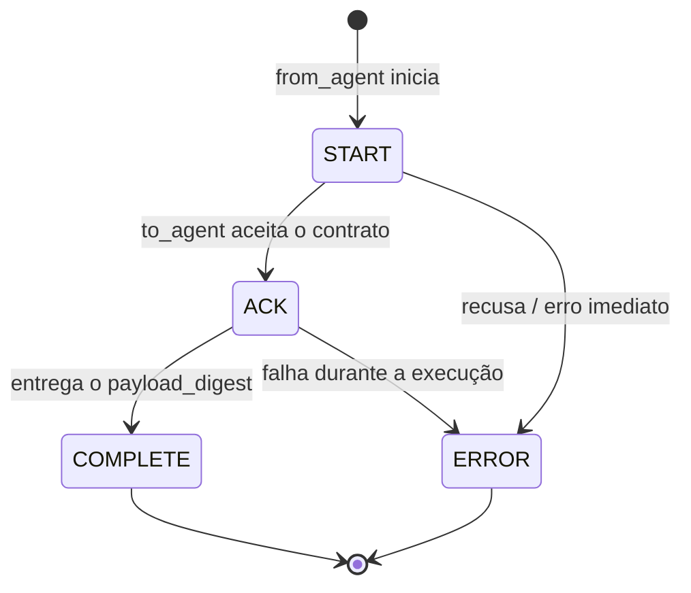
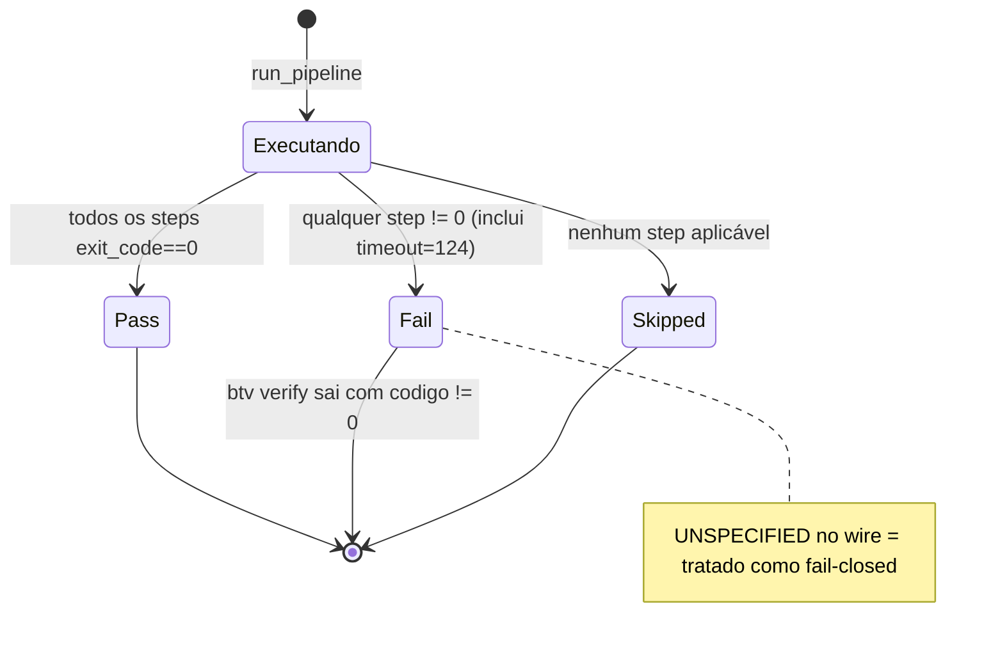
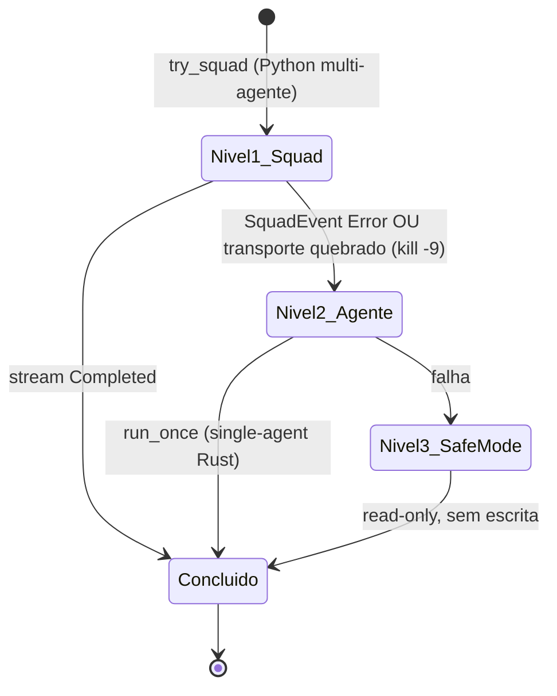
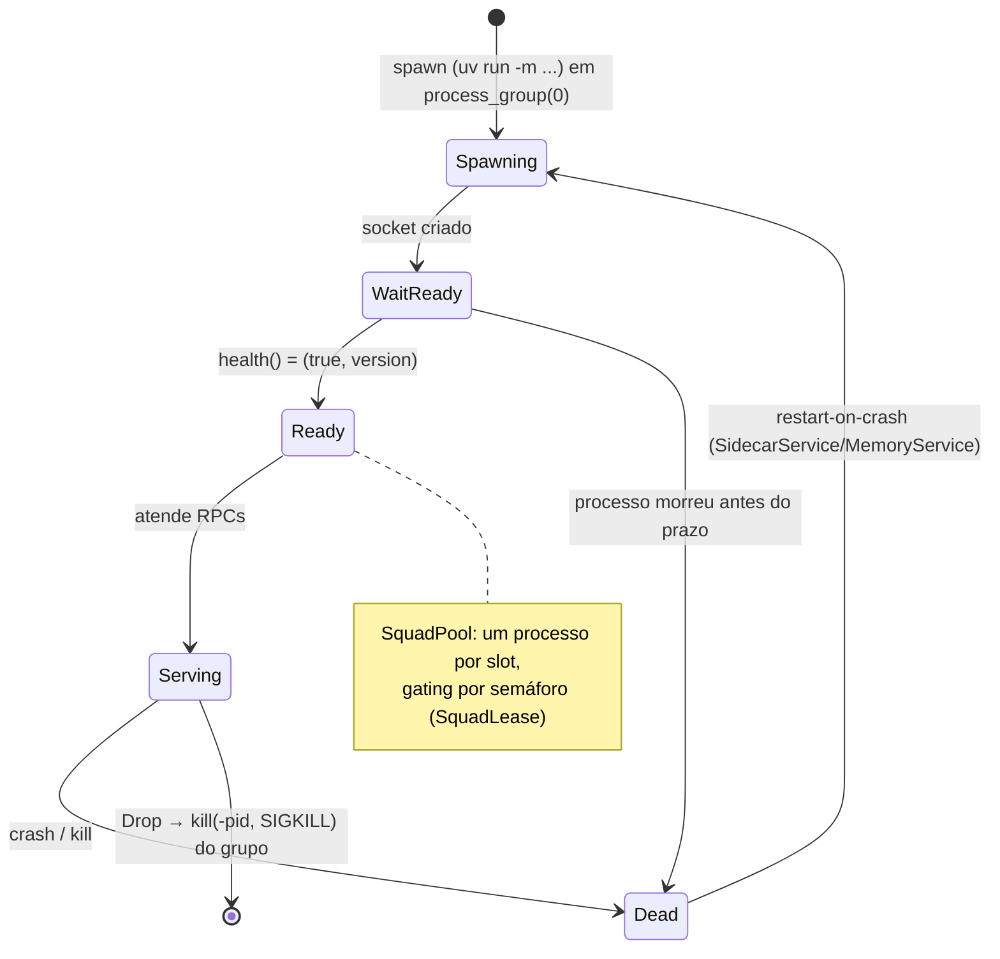
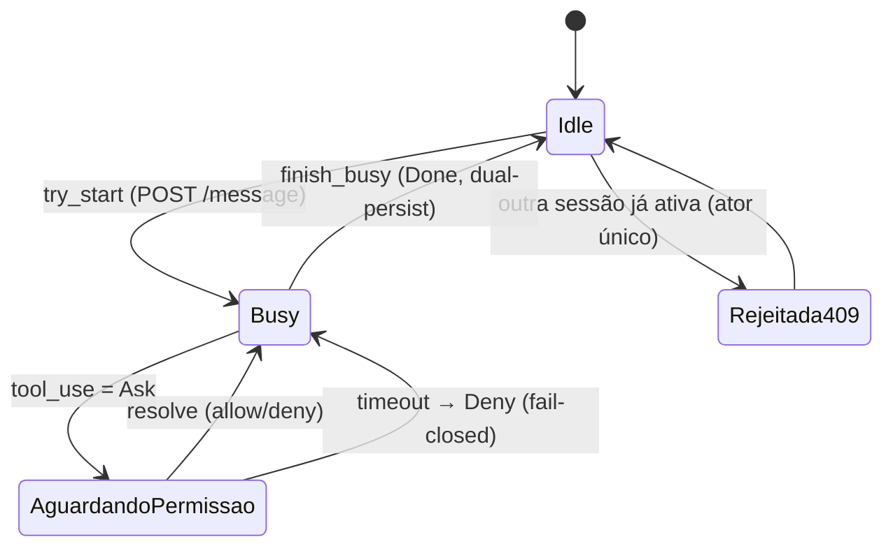

# 12 — Máquinas de estado

Os estados e transições dos tipos que os têm. Fonte anotada por diagrama.

---

## 12.1 `RunStatus` — ciclo de vida de uma squad

Fonte: `crates/btv-domain/src/ports.rs` (`RunStatus::can_transition_to`). A mutação só
acontece pelo agregado (`Run::transition_to`); transição inválida retorna
`RunError::InvalidTransition` **sem** mudar o estado.

```mermaid
stateDiagram-v2
    [*] --> Ativa : Run::activate
    Ativa --> Concluida : tarefa entregue
    Ativa --> Encerrada : encerramento / reconciliação de zumbi
    Ativa --> Erro : falha
    Concluida --> [*]
    Encerrada --> [*]
    Erro --> [*]
    note right of Ativa
        approve_gate só é válido em Ativa
        (incrementa gates_aprovados)
    end note
    note right of Concluida
        Estados terminais: nenhuma transição de saída.
        Concluida→Ativa retorna InvalidTransition.
    end note
```

---

## 12.2 Decisão de permissão de ferramenta

Fonte: `crates/btv-core/src/permission.rs` (`PermissionEngine::evaluate`) +
`agent_loop.rs` (`run_tool`). `Ask` delega ao `PermissionResolver` (CLI: stdin; web:
`WebPermissionResolver` fail-closed).



---

## 12.3 Fase de handoff entre agentes

Fonte: `schemas/proto/squad.proto` (`Handoff.Phase`) + `btv-schemas::handoff`.



---

## 12.4 Veredito do `/verify`

Fonte: `crates/btv-schemas/src/verification.rs` (`Verdict`, `derive_verdict`).



---

## 12.5 Degradação progressiva do squad (3 níveis)

Fonte: `crates/btv-cli/src/squad.rs` (`run_squad`) + `btv-sidecar::drain_stream`
(`SquadRun::{Completed|Failed}`).



---

## 12.6 Ciclo de vida do sidecar supervisionado

Fonte: `crates/btv-sidecar/src/{supervisor.rs, service.rs}` (ADR 0019).



---

## 12.7 Sessão de código web (ator único)

Fonte: `crates/btv-cli/src/web_agent.rs` (`SessionHub`, ADRs 0016/0018).


