# 13 — Diagramas de módulo por crate (Rust)

Estrutura interna de cada um dos 14 crates: módulos (nós) e suas dependências internas
(setas). Complementa o [diagrama de pacotes (03)](03-pacotes.md), que mostra as
dependências *entre* crates. Inventário textual: [referência 10](../referencia/10-rust-crates.md).

---

## btv-domain

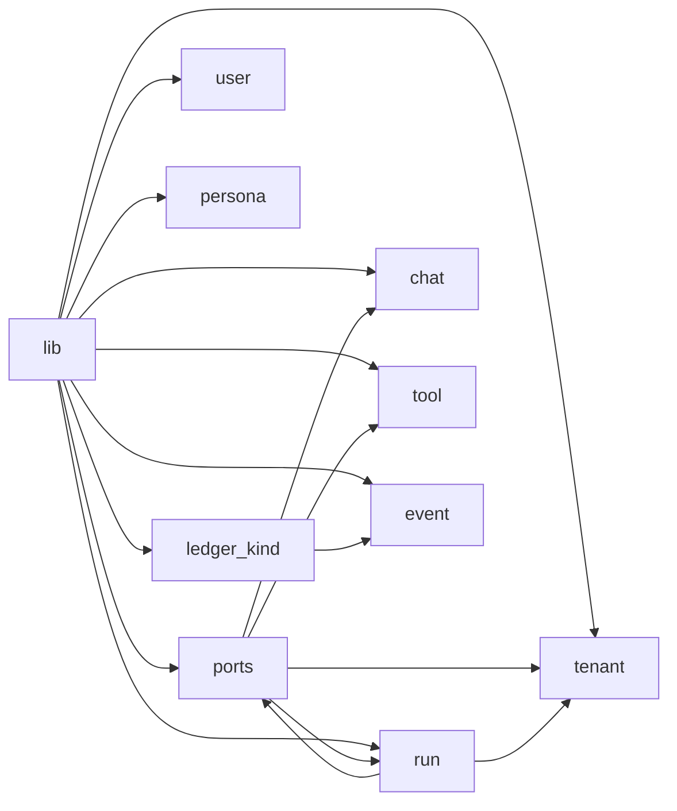

`ports` (traits + agregado `Run` + `DomainEvent`) é o centro; `chat`/`tool` são os tipos
neutros de provider que o runtime consome; `tenant` é transversal (todo método de repo o
recebe).

## btv-core

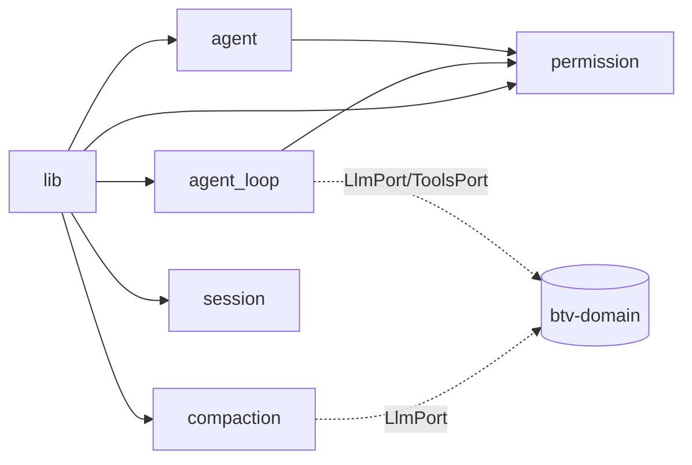

`agent_loop` é o coração; `permission` é o motor de decisão; `agent` (perfis) produz
`PermissionEngine`; `compaction` resume histórico.

## btv-llm

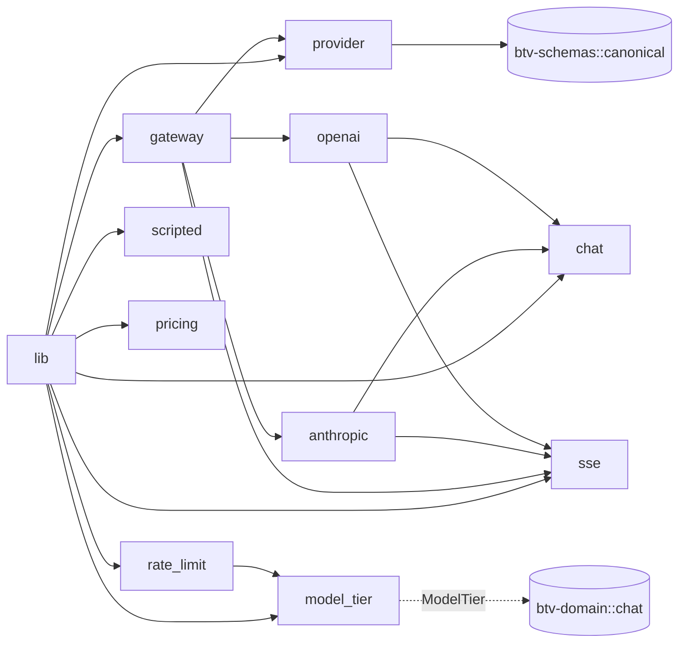

`gateway` implementa `LlmPort` e despacha por `ProviderId` para os transportes
`anthropic`/`openai`; `rate_limit` e `scripted` sustentam decorators e testes.

## btv-tools

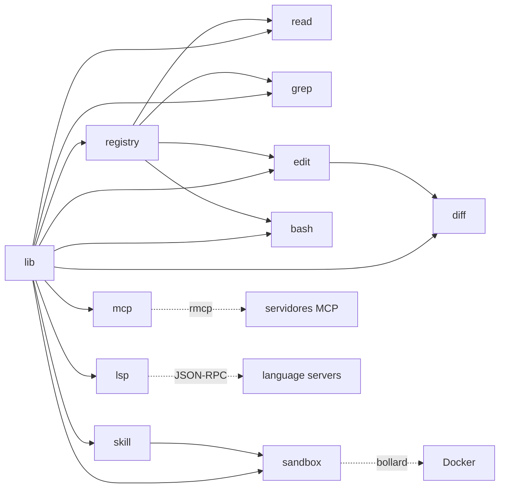

`registry` implementa `ToolsPort`; `skill`/`mcp`/`lsp` são registrados por `btv-cli`;
`sandbox` só é alcançado via `skill` (terceiro).

## btv-store

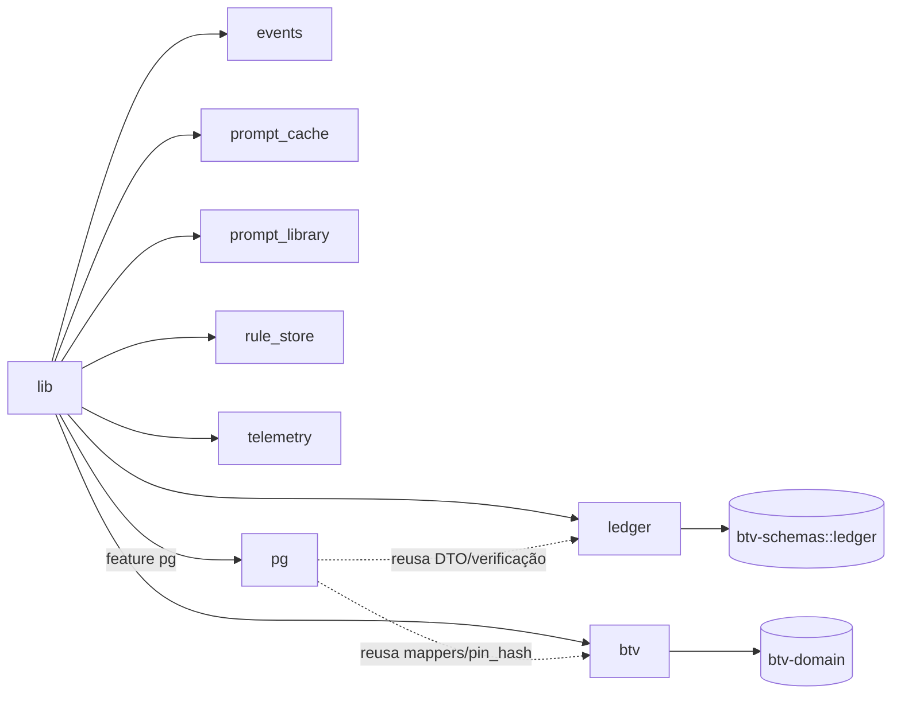

`ledger`/`btv`/`events` são os adapters SQLite das ports; `pg` é o adapter Postgres que
**reusa** as funções compartilhadas do ledger e do btv → paridade.

## btv-verify

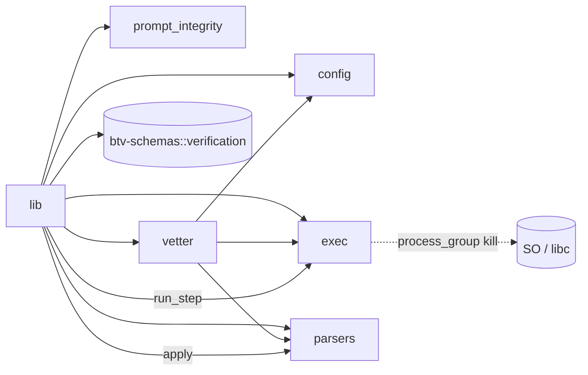

`exec` roda subprocessos com kill de grupo; `parsers` extraem findings; `vetter` reusa a
mesma máquina para decidir `Vet`/`Block`.

## btv-schemas

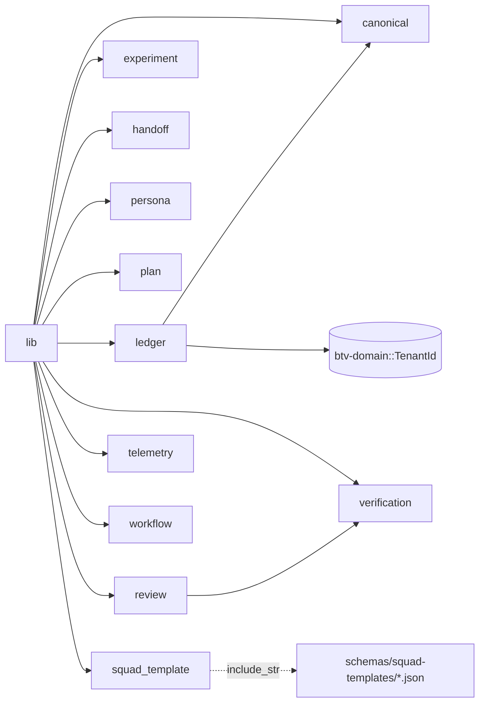

`canonical` é o hash `prompt-cache-key.v1` (twin de `hashing.py`); `verification` é o
contrato compartilhado com `btv-verify` **e** `review`.

## btv-sidecar

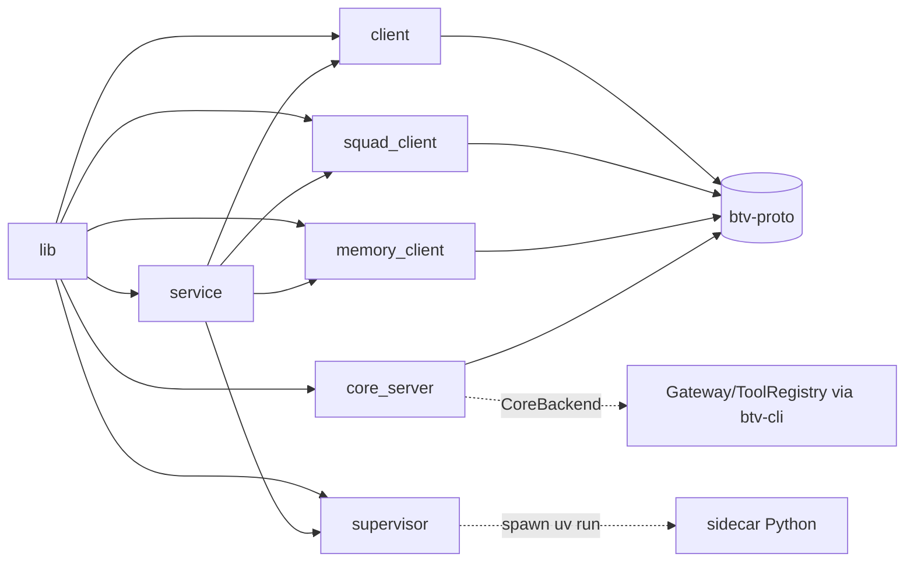

Clientes (Rust→Python) + `core_server` (Python→Rust) + supervisores/pool (ciclo de vida).

## btv-server

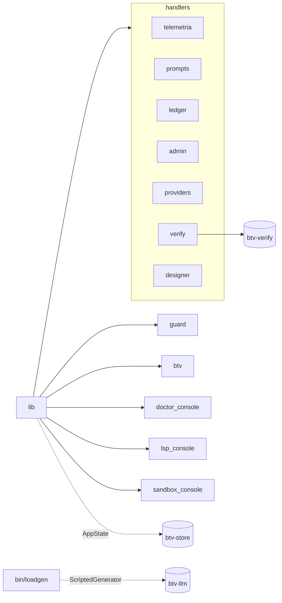

`lib::router` monta as rotas + SPA fallback + guard de Origin; `handlers/*` falam só com
`btv-store` (SQL cru proibido por lint T4).

## btv-cli (composition root)

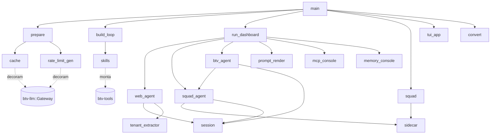

Onde tudo se amarra: `prepare` constrói o stack de generators, `build_loop` injeta tools +
permissões no `AgentLoop`, `run_dashboard` mescla os routers HTTP.

## btv-tui, btv-proto, btv-golden, btv-contract (módulo único)

Crates de um só arquivo (`lib.rs`), sem grafo interno relevante:

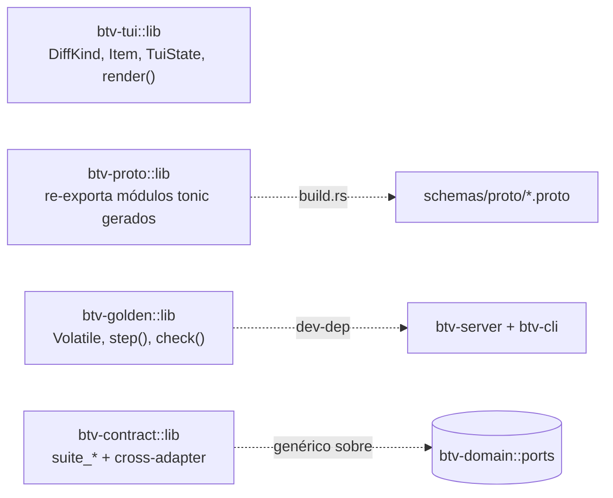
