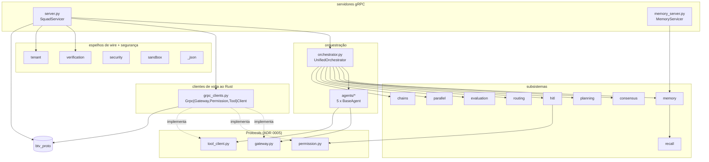
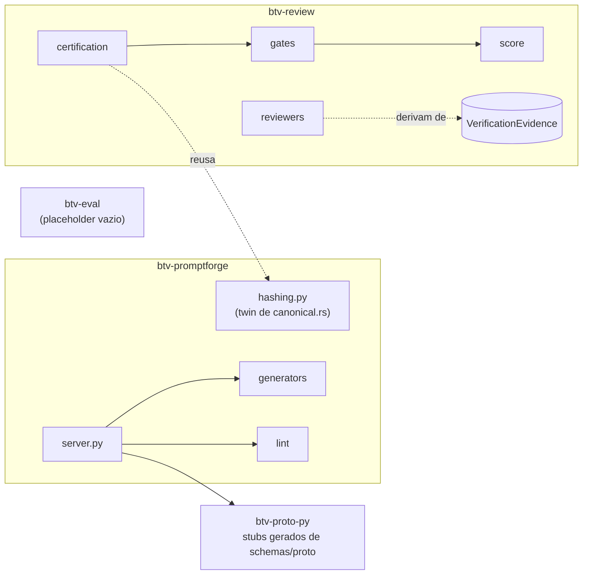
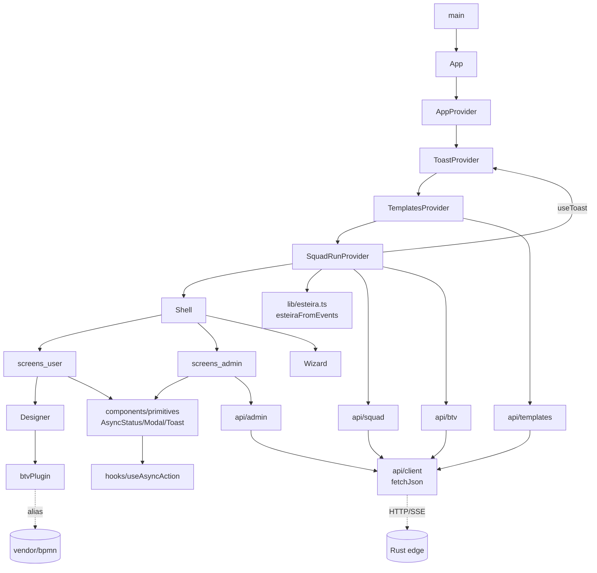
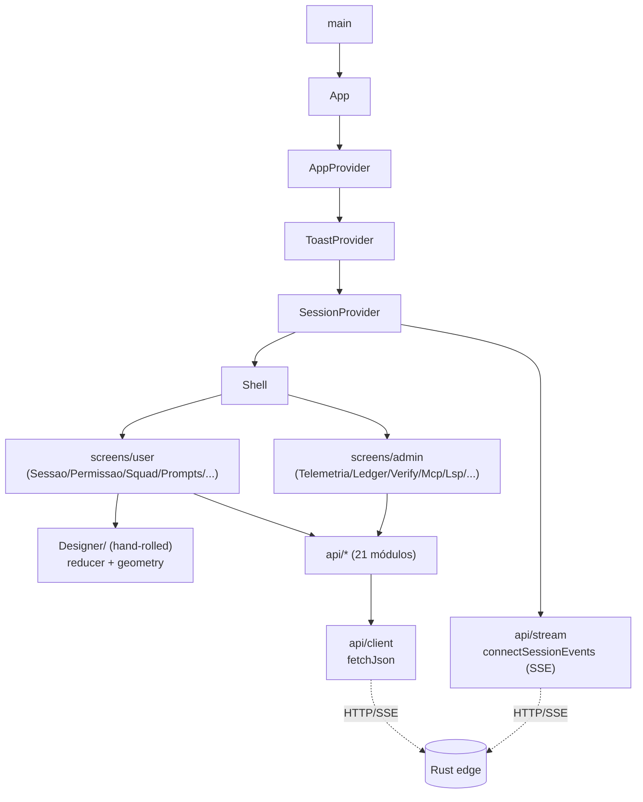

# 14 — Diagramas de módulo: Python e frontend

Estrutura interna dos 5 pacotes Python e das 2 SPAs. Inventário textual:
[referência 11 (Python)](../referencia/11-python-pacotes.md) e
[referência 12 (TypeScript)](../referencia/12-typescript-frontend.md).

---

## Python

### btv-squad (o pacote central)

`server.py` é o ponto onde Python-serve-gRPC encontra Python-chama-Rust: injeta os
`Grpc*Client` no `UnifiedOrchestrator`, que compõe os subsistemas e os 5 agentes.

### btv-promptforge · btv-review · btv-proto-py · btv-eval

`hashing.py` é reusado por `btv-review.certification` (mesmo esquema canônico). `btv-eval`
é placeholder; a avaliação A/B real vive no Rust.

---

## Frontend

### btv-web (produto)

### web (console dev)

**Nota.** As duas SPAs compartilham o padrão Context+reducer e um `api/client` idêntico. A
diferença de arquitetura é o Designer (`btv-web`: sobre `@bpmn-react/*`; `web`: board
próprio) e o hook central (`btv-web`: `SquadRunContext`+esteira; `web`: `SessionContext`).
