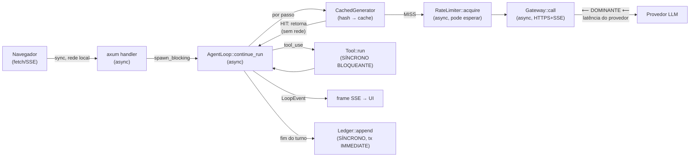

# 02 — Mapa de caminho crítico de performance

**Pergunta:** onde cada milissegundo importa?
**Entrada:** estrutura do código (sync/async/bloqueante), benches criterion e k6 do CI.
**Honestidade:** `sync/async/bloqueante/paralelizável` são **fatos estáticos**. Latências
**medidas** aparecem quando existem (k6/bench); o p99 **ponta a ponta** é `⟨medir⟩` — a
maior parcela é a **rede do provedor LLM**, fora do controle do repo.

---

## 2.1 Pipeline de latência ponta a ponta (sessão de código / squad)



## 2.2 Anotações por função do hot path

| Função | Arquivo | Sync/Async | Bloqueante? | Paralelizável? | Latência |
|---|---|---|---|---|---|
| `AgentLoop::continue_run` | btv-core/agent_loop.rs | async | não (roda em `spawn_blocking` na web) | não (loop sequencial por passo) | domina pelo `generate` |
| `CachedGenerator::generate` | btv-cli/cache.rs | async | não | — | **hit ≈ custo do hash** (barato); miss → cai adiante |
| `request_hash` (cache key) | btv-schemas/canonical.rs | sync | não | — | **bench `cargo bench -p btv-schemas`** (job `bench`) |
| `RateLimiter::acquire` | btv-llm/rate_limit.rs | async | **espera** se janela cheia | — | 0 se há vaga; senão dorme até liberar |
| `Gateway::call_provider` | btv-llm/gateway.rs | async | não (stream) | **sim** (mas usa fallback sequencial por provider) | **⟨medir⟩ — dominada pelo provedor**; k6 com `ScriptedGenerator` isola o overhead do gateway (P95≈3.5ms) |
| `Tool::run` (bash/edit/...) | btv-tools/*.rs | **sync** | **SIM — bloqueante** | não no loop; roda em `spawn_blocking` no core | bash: até `timeout` (default 120s, max 600s) |
| `Sandbox::run` (skill 3º) | btv-tools/sandbox.rs | async (em thread própria) | contido em thread+runtime | — | até `timeout` (default 30s) |
| `Ledger::append` | btv-store/ledger.rs | **sync** | **SIM — `BEGIN IMMEDIATE` pega write-lock** | não (serializa por tenant) | I/O SQLite (WAL); `⟨medir⟩` |
| `estimate_tokens` (compaction) | btv-core/compaction.rs | sync | não | — | `chars/4` (O(n) no histórico); bench `-p btv-core` |
| `CompactionPolicy::summarize` | btv-core/compaction.rs | async | não | — | 1 chamada LLM extra (cara — só quando dispara) |

## 2.3 Roundtrip do hash Rust↔Python (UDS)

```
LlmRequest.messages_json ──[Python: canonical_json → sha256]──► cache key
        │                                                          │
        └──[Rust: btv_schemas::request_hash]──────────────────────┘
                        (mesma string → cache hit determinístico)
```

O hash é **puro e barato** dos dois lados (sha256 de JSON canônico). O custo real do
roundtrip é a **chamada gRPC/UDS** (`CoreService.Generate`), não o hash. O cache
(`prompt_cache` table) evita a chamada ao provedor quando a key bate.

## 2.4 Candidatos a otimização (anotações estáticas)

| Ponto | Observação | Sugestão |
|---|---|---|
| `Tool::run` síncrono | Já roda sob `spawn_blocking` no core; no `RunTool` do sidecar idem. Bash pode segurar até 120s. | OK. Vigiar `timeout` default alto; considerar limite por tipo de tool. |
| `Gateway` fallback sequencial | Tenta provider 1, depois 2, depois 3 — **serial**. | Se P99 de conexão importar, considerar hedged request (paralelo) — hoje prioriza custo/determinismo. |
| `Ledger::append` serializa por tenant | `BEGIN IMMEDIATE` é correto para consistência; é ponto de contenção sob escrita concorrente. | Aceitável local-first; no PG já há retry otimista (64 tentativas). |
| Passos do squad | O orquestrador **já paraleliza** passos independentes (`ParallelResourceManager`, semáforo). | Manter; medir o teto do semáforo. |
| Compaction | `summarize` é 1 chamada LLM extra; só dispara perto do limite (tier-gated). | OK; é economia de contexto, não hot path constante. |

## 2.5 O que É medido de verdade no CI

- **Job `bench`** (criterion, roda de verdade): `btv-schemas/canonical` (hash),
  `btv-core/compaction`, `btv-llm/gateway`.
- **Job `k6`**: sobe `loadgen` (`ScriptedGenerator`, sem key) e valida **P95 < 100ms**
  (documentado P95≈3.5ms) — isola o overhead do *nosso* caminho de gateway, sem a rede do
  provedor.

Tudo o mais marcado `⟨medir⟩` exige `cargo bench`/`tarpaulin`/telemetria — **não fabricado
aqui**.
