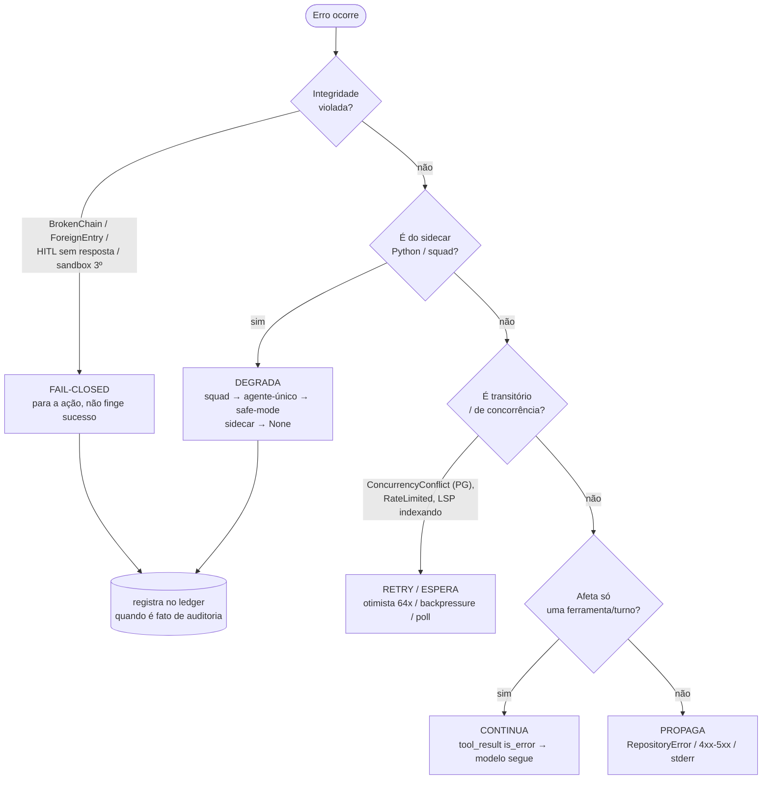

# 03 — Mapa de failure modes e propagação de erro

**Pergunta:** se X falhar, onde o sistema para — e onde ele deveria continuar?
**Entrada:** enums de `Result`/`Option`, match arms de tratamento.
**Base:** 100% estático.

> **Sobre "Alerta?":** o sistema é **local-first sem infraestrutura de monitoramento/alerta**.
> Não há Sentry/Prometheus/pager. Os substitutos reais de "alerta" são: o **ledger**
> (trilha auditável append-only), o **veredito fail-closed** (que interrompe a ação), o
> **job `verify` do CI** (falha o build) e **stderr**. A coluna abaixo reflete isso
> honestamente, não uma pilha de alerting que não existe.

---

## 3.1 Tabela de erros por componente

| Origem | Erro (variante) | Recoverable? | Handler | Retry? | "Alerta"? |
|---|---|---|---|---|---|
| `Gateway::generate` | `LlmError::NoProvider` | não (config) | erro claro ao usuário (defina API key) | — | stderr |
| `Gateway::generate` | `LlmError::AllFailed(msg)` | parcial | **fallback de providers** (Anthropic→DeepSeek→OpenAI) já tentado; erro se todos falham | fallback serial | stderr |
| `RateLimiter::acquire` | `LlmError::RateLimited` | sim | espera até `max_wait`; senão propaga | backpressure (espera) | stderr |
| `LedgerStore::append` | `LedgerError::BrokenChain{seq}` | **não — fatal** | **fail-closed** (integridade violada) | — | **ledger/verify (crítico)** |
| `LedgerStore::verify_chain` | `LedgerError::ForeignEntry` | não | fail-closed (anti-transplante) | — | crítico |
| `LedgerStore::*` | `LedgerError::Storage/Serde` | depende | propaga `RepositoryError::Storage` | — | stderr |
| repositórios | `RepositoryError::NotFound` | sim | 404 / `Ok(None)` | — | não |
| repositórios | `RepositoryError::ConcurrencyConflict` | sim | 409; no PG **retry otimista (64x)** | sim (PG) | não |
| `Run::approve_gate/transition_to` | `RunError::InvalidTransition` | sim | recusa **sem mutar estado**; 4xx | — | não |
| `Run::activate` | `RunError::InvalidState` | sim | 4xx (ex.: papéis vazios) | — | não |
| `EventStore::append` | `EventError::Conflict{expected,found}` | sim | `ConcurrencyConflict` → recarrega head | manual | não |
| `Tool::run` | `ToolError::InvalidArgs/Execution` | sim | vira `tool_result{is_error:true}` → **modelo continua** | — | não |
| ferramenta truncada | (não é erro) `ToolOutput.truncated` | sim | anexa nota + `overflow_path`, continua | — | não |
| `Sandbox::run` | `SandboxError::DaemonUnavailable` | **não p/ skill 3º** | **fail-closed** (skill não roda; nunca cai p/ execução direta) | — | stderr |
| `Sandbox::run` | `SandboxError::Execution` | sim | erro reportado, sessão segue | — | não |
| `SidecarClient/*` | `SidecarError::Unavailable/Rpc` | sim | **degrada**: `try_start → None`; squad → agente-único → safe-mode | — | stderr |
| `SquadService.ExecuteTask` | `SquadEvent::Error` (in-band) OU transporte quebrado | sim | `drain_stream → SquadRun::Failed` → **fallback progressivo** | — | ledger (consenso) |
| `RequestPermission` (HITL) | timeout / sem resposta | sim | **fail-closed → Deny** (ADR 0017) | — | ledger (override) |
| `AgentLoop::continue_run` | `LoopError::MaxSteps(n)` | não (limite) | erro; evita loop infinito | — | stderr |
| `canonical::request_hash` | `CacheKeyError::NumeroProibido` | sim | rejeita input divergente (ADR 0032) | — | não |
| `TenantContext`/`ActorId` | `TenantError::InvalidTenantId/EmptyActor` | não (construção) | falha na borda (fail-closed) | — | não |
| `PgStore` (SaaS) | erro sqlx / RLS | depende | mapeado p/ `RepositoryError`; RLS nega silenciosamente entre tenants | retry (append) | stderr |
| `Telemetry::*` | qualquer erro de DB | **sempre recoverable** | **engolido** (log stderr / default) — telemetria **nunca** derruba o caminho principal | — | não |

## 3.2 Fluxograma de propagação (os três padrões dominantes)

## 3.3 Princípios de tratamento observados

1. **Fail-closed onde a segurança/integridade importa:** permissão sem resposta = Deny;
   auditor sem evidência = reprova; sandbox de terceiro sem Docker = não executa; cadeia
   quebrada = para. Nunca "sem verificação = ok".
2. **Degradação progressiva onde a disponibilidade importa:** o sidecar Python é opcional
   — sua ausência degrada (squad → agente-único → safe-mode read-only), não quebra.
3. **Continuar onde o erro é local:** um `tool_result` de erro volta ao modelo, que decide
   o próximo passo — o loop não morre por uma ferramenta.
4. **Telemetria nunca é fatal:** qualquer falha de telemetria é engolida.
5. **Sem retry cego:** o único retry automático real é o **append otimista do PG (64x)** e o
   **poll do LSP enquanto indexa**; o "retry" de LLM é **fallback entre providers**, não
   reenvio ao mesmo. **Não há backoff exponencial no app** (o backoff exponencial de
   `git push` é do harness de CI, não do produto).

## 3.4 Lacunas honestas

- **Não há camada de alerta/monitoramento** (local-first). Um `BrokenChain` em produção
  SaaS dependeria de inspeção do ledger / do job `verify`, não de um pager.
- **Sem circuit breaker** no gateway — o fallback é a proteção; um provedor lento é
  limitado só pelos timeouts (`BTV_LLM_CONNECT_TIMEOUT_SECS`/`READ_TIMEOUT_SECS`).
