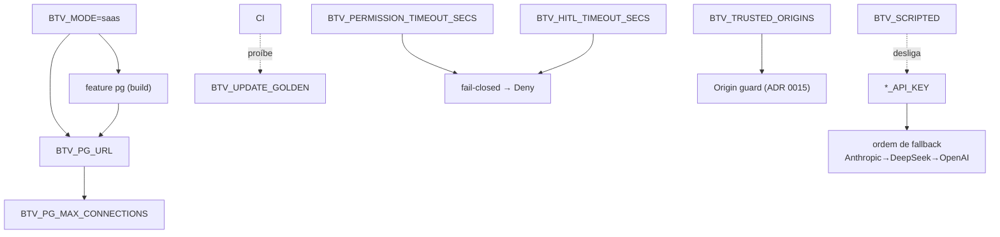

# 05 — Mapa de feature flags e variáveis de ambiente

**Pergunta:** quem controla o quê — e onde isso cria comportamento oculto?
**Entrada:** grep de `env::var` (Rust), `os.getenv` (Python), `clap`, `#[cfg(feature)]`,
`vite.config`. **Base:** 100% estático (todas as variáveis abaixo foram extraídas do código).

---

## 5.1 Variáveis de ambiente — Rust (todas as encontradas)

| Variável | Lida em | Efeito | Mutável? | Secreta? | Interage com |
|---|---|---|---|---|---|
| `ANTHROPIC_API_KEY` | btv-llm/gateway.rs | habilita provider Anthropic (1º no fallback) | start-only | **SIM** | fallback (ordem) |
| `DEEPSEEK_API_KEY` | btv-llm/gateway.rs | habilita DeepSeek (2º) | start-only | **SIM** | fallback |
| `OPENAI_API_KEY` | btv-llm/gateway.rs | habilita OpenAI (3º) | start-only | **SIM** | fallback |
| `BTV_LLM_CONNECT_TIMEOUT_SECS` | btv-llm/gateway.rs | timeout de conexão (default 30) | start-only | não | — |
| `BTV_LLM_READ_TIMEOUT_SECS` | btv-llm/gateway.rs | timeout de leitura idle (default 120) | start-only | não | — |
| `BTV_DEFAULT_MODEL` | btv-cli/web_agent.rs | modelo default da sessão de código | start-only | não | `--model` |
| `BTV_SQUAD_MODEL` | btv-cli/squad_agent.rs (+ Python) | modelo default do squad | start-only | não | `SquadTask.model` |
| `BTV_MODE` | btv-cli/tenant_extractor.rs | modo local vs SaaS (resolução de tenant) | start-only | não | feature `pg`, `BTV_PG_URL` |
| `BTV_MAX_SESSIONS` | btv-cli/web_agent.rs | teto de sessões de código simultâneas (ADR 0020) | start-only | não | ator único |
| `BTV_WEB_CONTEXT_WINDOW` | btv-cli/web_agent.rs | janela de contexto p/ compaction na web | start-only | não | compaction |
| `BTV_WEB_MAX_STEPS` | btv-cli/web_agent.rs | limite de passos do loop na web | start-only | não | `LoopError::MaxSteps` |
| `BTV_WEB_MAX_TOKENS` | btv-cli/web_agent.rs | max_tokens por turno na web | start-only | não | — |
| `BTV_HITL_TIMEOUT_SECS` | btv-cli/squad_agent.rs | timeout do gate HITL do squad | start-only | não | fail-closed → Deny |
| `BTV_PERMISSION_TIMEOUT_SECS` | btv-cli/web_agent.rs | timeout da permissão de ferramenta (ADR 0017) | start-only | não | fail-closed → Deny |
| `BTV_TRUSTED_ORIGINS` | btv-server/guard.rs | hosts extras além de localhost (Origin guard) | start-only | não (mas sensível) | guard de CSRF (ADR 0015) |
| `BTV_WEB_DIR` | btv-server/lib.rs | dir do SPA produto (default `btv-web/dist`) | start-only | não | — |
| `BTV_DEV_WEB_DIR` | btv-server/lib.rs | dir do console dev (default `web/dist`) | start-only | não | — |
| `BTV_LOADGEN_PORT` | btv-server/bin/loadgen.rs | porta do alvo k6 (default 7900) | start-only | não | — |
| `BTV_PYTHON_DIR` | btv-cli/{sidecar,squad}.rs | localização do workspace Python | start-only | não | sidecar (try_start) |
| `BTV_PG_URL` | btv-cli/main.rs | URL de conexão Postgres (SaaS) | start-only | **SIM** (credencial) | feature `pg`, `BTV_MODE` |
| `BTV_PG_MAX_CONNECTIONS` | btv-store/pg.rs | tamanho do pool PG | start-only | não | feature `pg` |
| `BTV_PG_TEST_URL` | btv-store/pg.rs | URL de PG para testes | start-only | **SIM** | job `pg` do CI |
| `BTV_SCRIPTED` | web_agent/squad_agent/golden | usa `ScriptedGenerator` sem key (testes/e2e) | start-only | não | **desliga** chamadas LLM reais |
| `BTV_UPDATE_GOLDEN` | btv-golden/lib.rs | reescreve fixtures golden | start-only | não | **bloqueado** se `CI` setado |
| `CI` | btv-golden/lib.rs | detecta ambiente de CI | (ambiente) | não | proíbe `BTV_UPDATE_GOLDEN` |
| `PROTOC` | btv-proto/build.rs | caminho do protoc (senão usa o vendorizado) | build-time | não | build |

## 5.2 Variáveis de ambiente — Python

| Variável | Lida em | Efeito | Mutável? | Secreta? |
|---|---|---|---|---|
| `BTV_SQUAD_MODEL` | btv_squad (config) | modelo default do orquestrador (12-Factor) | start-only | não |
| `BTV_LOG_LEVEL` | btv_squad | nível de log do sidecar | start-only | não |

> **Nota:** o sidecar Python **nunca** lê API keys — elas só existem no processo Rust
> (ADR 0001). Não há `*_API_KEY` no grep do Python.

## 5.3 Config do frontend (vite)

| Config | Onde | Efeito |
|---|---|---|
| proxy `/api` → `127.0.0.1:7878` | `vite.config.ts` (ambos) | dev: encaminha REST/SSE ao `btv dashboard` |
| `resolve.alias @bpmn-react/*` | `btv-web/vite.config.ts` | aponta p/ o dist ESM do submódulo `vendor/bpmn` |
| `resolve.dedupe: [react, react-dom]` | `btv-web/vite.config.ts` | força a cópia única do React 19 (evita erro #525) |
| `base: './'` | `web/vite.config.ts` | permite montar o console em `/dev` |

## 5.4 Feature de build (`Cargo.toml`)

| Feature | Crates | Efeito | Tipo | Interação |
|---|---|---|---|---|
| `pg` | btv-store, btv-cli | compila o adapter Postgres (`sqlx`, `PgStore`, `migrations_pg`), o subcomando `btv session` e a resolução de tenant SaaS | build-time | **NÃO** exclui SQLite — os dois adapters coexistem; ativa junto com `BTV_MODE=saas` + `BTV_PG_URL` |

**É a única feature do workspace.** Não há `uds`/`serde` como flags (são sempre compilados).

## 5.5 Flags de CLI (`btv-cli`, clap)

Subcomandos: `run`, `chat`, `tui`, `verify`, `squad`, `dashboard`, `experiment`, `session`
(este último só com feature `pg`). Flags transversais notáveis: `--model` (herda de
`BTV_DEFAULT_MODEL`/`BTV_SQUAD_MODEL`), `--agent` (perfil build/plan/general),
`--yes` (auto-aprova permissões no squad CLI), `dashboard --no-web-agent` (modo só-leitura),
`dashboard --port/--host`. Detalhe campo a campo no
[dicionário de dados 14](../dados/14-rust-cli.md).

## 5.6 Grafo de interdependência das flags

## 5.7 Comportamento oculto a vigiar

- **`BTV_SCRIPTED`** troca silenciosamente o gerador real por um roteirizado — ótimo em
  teste, perigoso se vazar para produção (não haveria chamada LLM real).
- **`BTV_TRUSTED_ORIGINS`** afrouxa o guard de CSRF; qualquer host listado passa. Reabrir
  indevidamente reabre o vetor que o ADR 0015 fecha.
- **`BTV_MODE=saas` sem `feature pg`** ou sem `BTV_PG_URL`: o caminho SaaS não tem adapter —
  a resolução de tenant precisa dos três alinhados.
- **Timeouts** (`*_TIMEOUT_SECS`) altos mascaram lentidão do provedor/HITL; baixos demais
  disparam fail-closed (Deny) cedo.
