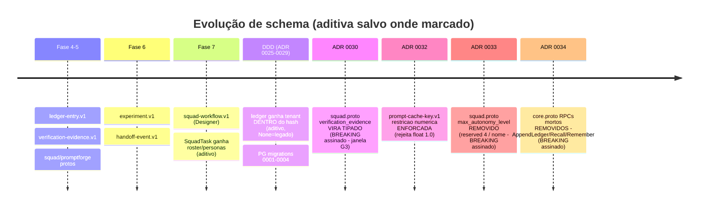
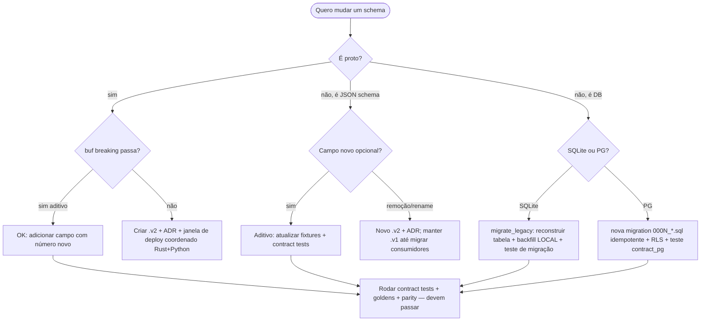

# 06 — Mapa de migração de schema (DB + protobuf + JSON)

**Pergunta:** o que quebra se eu alterar X — e como migrar sem downtime?
**Entrada:** `schemas/proto/*` + `buf.yaml`, `schemas/json/*.v1.schema.json`,
`crates/btv-store/migrations_pg/*.sql`, `migrate_legacy` (SQLite), ADRs 0025–0034.

---

## 6.1 As três regras de evolução do projeto

1. **Protobuf — só aditivo.** O job `buf` do CI roda `buf breaking` contra a `main`. Mudança
   breaking exige **arquivo `.v2` + ADR novo**, e (na migração DDD) só na **janela G3 com
   deploy coordenado Rust+Python**. Hoje **não existe nenhum `.v2`** — tudo é `.v1`.
2. **JSON Schema — versionado no nome** (`*.v1.schema.json`). Campos novos entram aditivos;
   quebra = novo `.v2` + ADR. Contract tests (goldens T1) travam o wire byte-a-byte.
3. **DB — aditivo + backfill determinístico.** SQLite migra por `migrate_legacy` (reconstrói
   tabelas cujo PK/unicidade passou a incluir `tenant`, backfill p/ `LOCAL`). Postgres tem
   migrations numeradas (`migrations_pg/000N_*.sql`, aplicadas por `sqlx::migrate!`).

## 6.2 Histórico de migrations Postgres

| Migration | Introduz |
|---|---|
| `0001_schema_multitenant.sql` | esquema base multitenant (runs, deliverables, ledger, RLS por tenant) |
| `0002_sessions.sql` | tabela de sessões SaaS (token_hash, deadlines) |
| `0003_template_pub.sql` | publicação de templates por tenant |
| `0004_users.sql` | perfis locais + PIN |

SQLite não tem migrations numeradas: `migrate_legacy` (em `btv.rs` e `ledger.rs`) faz o
backfill do tenant `LOCAL` sobre bancos pré-tenant, preservando `seq`/`prev_hash`/`entry_hash`
do ledger (sem re-hash) — provado por `tests/migracao_ledger_pre_tenant.rs` e
`tests/migracao_pre_tenant.rs`.

## 6.3 Linha do tempo dos schemas (o que já evoluiu)

## 6.4 Tabela de compatibilidade / tipo de mudança

| Artefato | Mudança | Tipo | Estratégia de migração |
|---|---|---|---|
| `ledger-entry.v1` | `tenant: Option<TenantId>` adicionado | **additive** | `None` mantém o corpo hasheado byte-idêntico ao legado; adapters preenchem do contexto (ADR 0027). Sem re-hash. |
| `SquadTask` (proto) | `roster: PersonaSpec[]`, `tenant_id`, `actor` adicionados | **additive** | vazio = comportamento pré-existente (elenco fixo, tenant local) |
| `squad.proto` | `verification_evidence` string→**mensagem tipada** | **breaking (assinado)** | ADR 0030: `buf breaking` acusa por design; Rust+Python sobem juntos (janela coordenada); ausente segue fail-closed no Python |
| `squad.proto` `SquadTask` | campo 4 `max_autonomy_level` **removido** (`reserved 4` + `reserved "max_autonomy_level"`) | **breaking (assinado)** | ADR 0033: autonomia progressiva nunca foi wireada (Fase 7); `reserved` impede reuso da tag/nome; `buf breaking` acusa por design; deploy Rust+Python coordenado |
| `core.proto` `CoreService` | RPCs mortos `AppendLedger`/`Recall`/`Remember` (+ mensagens) **removidos** | **breaking (assinado)** | ADR 0034: eram stubs `Unimplemented` na direção errada (Rust servindo memória/ledger ao Python), superados pelo `MemoryService` (ADR 0022). Protobuf não reserva RPC; `buf breaking` acusa; deploy coordenado |
| `prompt-cache-key.v1` | rejeição de floats de fração zero | **breaking de comportamento** | ADR 0032: enforça o que já era prosa; JS emite `1`, Rust/Python `1.0` — divergiria entre produtores. Fixtures de paridade guardam. |
| tabelas PG | `0002`–`0004` | **additive** (novas tabelas) | `sqlx::migrate!` aplica em ordem no boot |
| SQLite pré-tenant | coluna `tenant_id` | **additive + backfill** | `migrate_legacy` reconstrói e backfilla `LOCAL` |

## 6.5 Playbook: "eu quero alterar um schema"

## 6.6 Compatibilidade cruzada Rust↔Python

O único ponto que exige **versões alinhadas** é o **wire tipado da evidência de verificação**
(ADR 0030): como Rust e Python vivem no mesmo repo e sobem juntos, a janela de deploy é
coordenada — não há v1.3↔v1.2 conviverem em produção. O hash `prompt-cache-key.v1` também
exige paridade exata (qualquer mudança regenera fixtures e roda parity nos dois lados).
Para todo o resto (aditivo), um lado pode ir à frente sem quebrar o outro.
