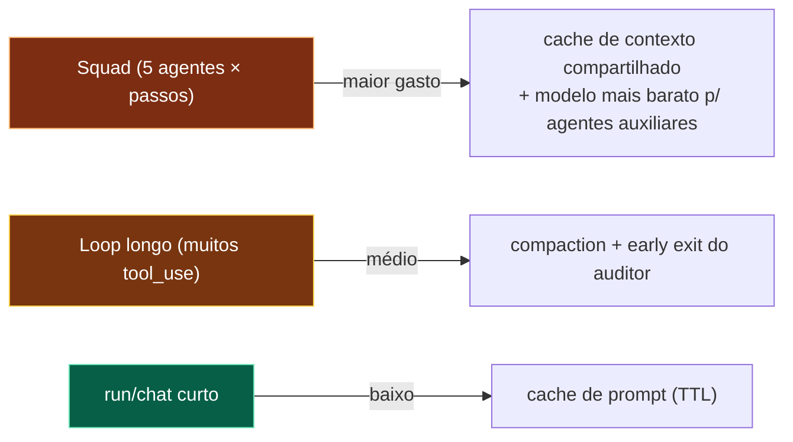

# 07 — Mapa de custos por operação

**Pergunta:** quanto custa cada ação — e onde otimizar para economizar?
**Entrada:** `crates/btv-llm/src/pricing.rs` (tabela estática), telemetria (`ModelUsage`).

> **Honestidade (a própria `pricing.rs` diz isso):** o custo é uma **estimativa** =
> `tokens reais × preço tabelado`. A tabela é **estática e envelhece** (data `AS_OF`).
> Modelo sem preço → `None` ("sem preço tabelado", **nunca** custo fabricado). Portanto
> **não há `$/request` nem cache hit ratio inventados** aqui — esses vêm de runtime via
> `GET /api/models/usage` e `GET /api/summary`. Este mapa dá o **modelo de custo** e as
> **alavancas**, que são estáticos e reais.

---

## 7.1 Onde o custo nasce

O **único custo monetário direto** do sistema é a **chamada LLM** (o gateway HTTPS aos
provedores). Storage local (SQLite), UDS, telemetria offline-first e ferramentas **não têm
custo monetário**. No modo SaaS, o Postgres agrega custo de infra (não modelado pela
telemetria — a A1 marca isso explicitamente como "não fabricado").

## 7.2 Fórmula de custo (o que o código realmente computa)

```
custo_usd(modelo, in_tokens, out_tokens) =
    in_tokens/1e6  × input_per_mtok(modelo)
  + out_tokens/1e6 × output_per_mtok(modelo)
```
`estimate_cost_usd` (pricing.rs) casa o `modelo` por substring na tabela `PRICES` (o mais
específico primeiro) e retorna `None` se não houver preço.

## 7.3 Tabela de preços embutida (USD por 1M tokens, `AS_OF = 2026-01`)

| Modelo (substring) | Provider | Input /Mtok | Output /Mtok |
|---|---|---|---|
| `haiku` | anthropic | $0.80 | $4.00 |
| `sonnet` | anthropic | $3.00 | $15.00 |
| `opus` | anthropic | $15.00 | $75.00 |
| `deepseek` | deepseek | $0.27 | $1.10 |
| `gpt-4o-mini` | openai | $0.15 | $0.60 |
| `gpt-4o` | openai | $2.50 | $10.00 |
| (demais no arquivo) | … | … | … |

> Estes são os números **reais embutidos** no código — mas são uma tabela estática; o custo
> vivo depende do modelo efetivamente usado e da contagem de tokens real de cada chamada.

## 7.4 Onde o custo se multiplica

| Fluxo | Nº de chamadas LLM (estrutura) | Observação |
|---|---|---|
| `btv run` / chat (1 tarefa) | 1..`max_steps` (loop até `end_turn`) | cada tool_use gera mais um turno |
| Compaction | +1 chamada (resumo) quando dispara | só perto do limite (tier-gated) |
| **Squad (motor real)** | ≈ **5 agentes × passos do plano × turnos** | o mais caro; ReAct do developer alterna tool/turno |
| Code review (via prompt) | 1..N | depende dos passos |

> O **número exato** de tokens por fluxo é `⟨medir⟩` — vem da telemetria (`llm.call` grava
> `input_tokens`/`output_tokens` reais por chamada; `model_usage` agrega por modelo).

## 7.5 Alavancas de economia (reais, no código)

| Alavanca | Onde | Efeito |
|---|---|---|
| **Prompt cache** | `CachedGenerator` (decorator externo) | hit **evita a chamada ao provedor** — economia direta; hit nunca consome vaga de rate-limit |
| **Escolha de modelo/tier** | `--model` / `BTV_*_MODEL`, `ModelTier` | DeepSeek (~$0.27/$1.10) vs Opus (~$15/$75) = ~50× no input |
| **Rate limit por tier** | `RateLimiter::for_tier` | teto de chamadas/janela (não reduz custo/chamada, mas limita gasto agregado) |
| **Compaction tier-gated** | `CompactionPolicy` | resume o histórico → menos tokens de input nas chamadas seguintes |
| **Paralelismo do squad** | `ParallelResourceManager` | não reduz custo, reduz **tempo** (mesmos tokens) |
| **Early exit / gate duro** | `AuditorAgent` (reprova sem evidência **antes** do gateway) | evita chamada LLM quando o resultado já é reprovável |
| **`ScriptedGenerator`** | testes/e2e/k6 | custo **zero** (sem key) — usado em CI/bench |

## 7.6 Heatmap de oportunidades (qualitativo)



## 7.7 Como obter os números reais

| Métrica | Fonte |
|---|---|
| Custo estimado por modelo | `GET /api/models/usage` (`estimate_cost_usd` × tokens reais, com `AS_OF`) |
| Cache hit ratio | `GET /api/summary` → `cache_hit_rate` |
| Tokens por sessão | telemetria `llm.call` (`.btv/telemetry.db`) |
| Custo de infra SaaS (PG) | **não modelado** — a A1 marca como "não fabricado" |
