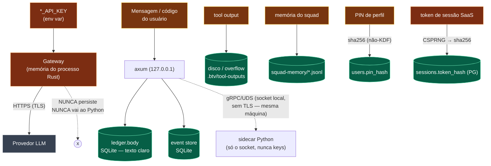

# 08 — Mapa de dados sensíveis e fluxo de segurança

**Pergunta:** onde PII, API keys e dados proprietários entram, saem e são armazenados?
**Entrada:** grep de `*_API_KEY`, persistência (ledger/DB/FS), endpoints HTTP, criptografia.
**Base:** 100% estático. Cruze com [failure modes (03)](03-failure-modes.md) e
[flags (05)](05-feature-flags-e-env.md).

> **Modelo de ameaça (ADR 0015):** o sistema é **local-first**; o dashboard bind só em
> `127.0.0.1`. O navegador é tratado como **hostil** (guard de Origin/Host fail-closed em
> toda rota mutável). Não há auth no modo local (perfis com PIN, sem login); o SaaS
> (`feature pg`) adiciona sessões com token.

---

## 8.1 Diagrama de fluxo de dados sensíveis

## 8.2 Tabela de dados sensíveis e risco

| Dado | Origem | Persistido? | Criptografado? | Exposição | Risco |
|---|---|---|---|---|---|
| `ANTHROPIC/DEEPSEEK/OPENAI_API_KEY` | env var | **NÃO** (só memória do processo Rust) | em memória (processo) | nunca ao Python, nunca ao navegador, nunca ao ledger | **ALTO** (se vazar da env/processo) |
| `BTV_PG_URL` (credencial PG) | env var | não | — | só no processo Rust (SaaS) | **ALTO** |
| Mensagem/código do usuário | request HTTP | **SIM** — `ledger.body`, event store | **NÃO** (SQLite em claro) | local (127.0.0.1) | **MÉDIO** (conteúdo proprietário em repouso sem cifra) |
| Tool output | ferramentas | SIM — disco + overflow | não | local FS | MÉDIO |
| Memória do squad (decisões) | orquestrador | SIM — JSONL | não | local FS | MÉDIO |
| Prompt efetivo de persona (U7) | usuário | **hash** no evento (`prompt_sha256`), prompt em claro no override do DB | não | local | MÉDIO (o wire carrega só o hash de procedência) |
| PIN de perfil | usuário | SIM — `pin_hash` | **sha256 (não é KDF)** | nunca sai do adapter | MÉDIO (sha256 puro é fraco p/ PIN curto) |
| Token de sessão SaaS | CSPRNG | só o **hash** (`token_hash`) | sha256; token claro existe 1 vez | prefixo `btvs_` | BAIXO (padrão correto: só hash guardado) |
| Telemetria (`props` JSON) | decorators | SIM — `telemetry.db` | não | local, offline-first (nada sai da máquina) | BAIXO-MÉDIO (pode conter model/tokens; não o conteúdo) |
| Logs (stderr) | vários | efêmero | não | terminal/CI | BAIXO (mas revisar se loga payload) |

## 8.3 Fronteiras de confiança e controles

| Fronteira | Controle | ADR |
|---|---|---|
| Navegador → axum | bind `127.0.0.1` + guard de Origin/Host (403 em não-GET de origem estranha) | 0015 |
| Sessão de código | ator único (409), permissão de ferramenta **fail-closed** (timeout→Deny) | 0017/0018 |
| Rust → Python | UDS **local** (sem TLS — mesma máquina, sem rede); Python **nunca** recebe keys | 0001 |
| Python (sidecar) | permissões avaliadas **no Rust** (`RunTool`/`RequestPermission`) — o sidecar não contorna | 0012/0023 |
| Skills de terceiro | sandbox Docker (rootfs RO, `cap_drop ALL`, `no-new-privileges`, rede off), fail-closed | 0011 |
| MCP externo | mesma engine de permissão, servidor declarado | 0012 |
| Rust → Provedor LLM | HTTPS (TLS) | — |
| SaaS multitenant | RLS por tenant no PG + `WHERE tenant_id` (defesa em profundidade) | 0026 |
| Ledger | hash-chain por tenant, tenant dentro do hash (anti-transplante) | 0027 |

## 8.4 Endpoints — público vs local

Todos os `/api/*` bind em `127.0.0.1`. **Não há endpoint na internet pública** no modo
local (o `infra/` é esqueleto sem alvo de deploy real). Rotas mutáveis (não-GET) passam pelo
guard de Origin. No SaaS, a borda de identidade (ADR 0029) resolve tenant/sessão — mas o
dashboard ainda bind local; expor exige proxy/ingress com auth (e `BTV_TRUSTED_ORIGINS`).

## 8.5 Lacunas honestas (GDPR / segurança)

- **Sem criptografia em repouso:** `.btv/*.db` e o JSONL são texto/SQLite em claro. Num
  contexto com PII, isso é o item nº 1 a endereçar (ex.: SQLCipher, disco cifrado).
- **PIN com sha256 puro** (documentado como não-KDF): adequado como sinal, fraco contra
  brute-force de PIN curto — um KDF (argon2/bcrypt) seria o correto se o PIN virar credencial real.
- **Sem retenção/expurgo automático:** o ledger é append-only por design (não deleta) — um
  "direito ao esquecimento" GDPR exigiria estratégia explícita (o override marcado registra,
  não apaga).
- **Sem redaction de logs:** revisar se algum `log`/stderr imprime payload de usuário.
- **Sem auth no modo local** (por design): qualquer processo local que alcance `127.0.0.1:7878`
  fala com o dashboard — o guard protege contra CSRF de navegador, não contra processo local.
