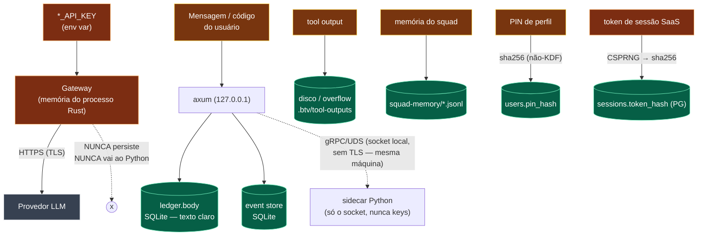

# 08 — Mapa de dados sensíveis e fluxo de segurança

**Pergunta:** onde PII, API keys e dados proprietários entram, saem e são armazenados?
**Entrada:** grep de `*_API_KEY`, persistência (ledger/DB/FS), endpoints HTTP, criptografia.
**Base:** 100% estático. Cruze com [failure modes (03)](03-failure-modes.md) e
[flags (05)](05-feature-flags-e-env.md).

> **Modelo de ameaça (ADR 0015):** o sistema é **local-first**; o dashboard bind só em
> `127.0.0.1`. O navegador é tratado como **hostil** (guard de Origin/Host fail-closed em
> toda rota mutável). Não há auth no modo local (perfis com PIN, sem login); o SaaS
> (`feature pg`) adiciona sessões com token.

---

## 8.1 Diagrama de fluxo de dados sensíveis

```mermaid
flowchart TB
    classDef secret fill:#7c2d12,stroke:#fdba74,color:#fff
    classDef user fill:#78350f,stroke:#fcd34d,color:#fff
    classDef store fill:#065f46,stroke:#6ee7b7,color:#fff
    classDef ext fill:#374151,stroke:#d1d5db,color:#fff

    ENV["*_API_KEY\n(env var)"]:::secret --> GW["Gateway\n(memória do processo Rust)"]:::secret
    GW -->|"HTTPS (TLS)"| LLM["Provedor LLM"]:::ext
    GW -. "NUNCA persiste\nNUNCA vai ao Python" .-> X1((x))

    USERMSG["Mensagem / código\ndo usuário"]:::user --> HTTP["axum (127.0.0.1)"]
    HTTP --> LEDGER[("ledger.body\nSQLite — texto claro")]:::store
    HTTP --> EVENTS[("event store\nSQLite")]:::store
    TOOL["tool output"]:::user --> FS[("disco / overflow\n.btv/tool-outputs")]:::store
    ORCH["memória do squad"]:::user --> JSONL[("squad-memory/*.jsonl")]:::store

    HTTP -.->|"gRPC/UDS (socket local,\nsem TLS — mesma máquina)"| PY["sidecar Python\n(só o socket, nunca keys)"]
    PIN["PIN de perfil"]:::user -->|"sha256 (não-KDF)"| USERS[("users.pin_hash")]:::store
    TOKEN["token de sessão SaaS"]:::secret -->|"CSPRNG → sha256"| SESS[("sessions.token_hash (PG)")]:::store
```

## 8.2 Tabela de dados sensíveis e risco

| Dado | Origem | Persistido? | Criptografado? | Exposição | Risco |
|---|---|---|---|---|---|
| `ANTHROPIC/DEEPSEEK/OPENAI_API_KEY` | env var | **NÃO** (só memória do processo Rust) | em memória (processo) | nunca ao Python, nunca ao navegador, nunca ao ledger | **ALTO** (se vazar da env/processo) |
| `BTV_PG_URL` (credencial PG) | env var | não | — | só no processo Rust (SaaS) | **ALTO** |
| Mensagem/código do usuário | request HTTP | **SIM** — `ledger.body`, event store | **NÃO** (SQLite em claro) | local (127.0.0.1) | **MÉDIO** (conteúdo proprietário em repouso sem cifra) |
| Tool output | ferramentas | SIM — disco + overflow | não | local FS | MÉDIO |
| Memória do squad (decisões) | orquestrador | SIM — JSONL | não | local FS | MÉDIO |
| Prompt efetivo de persona (U7) | usuário | **hash** no evento (`prompt_sha256`), prompt em claro no override do DB | não | local | MÉDIO (o wire carrega só o hash de procedência) |
| PIN de perfil | usuário | SIM — `pin_hash` | **sha256 (não é KDF)** | nunca sai do adapter | MÉDIO (sha256 puro é fraco p/ PIN curto) |
| Token de sessão SaaS | CSPRNG | só o **hash** (`token_hash`) | sha256; token claro existe 1 vez | prefixo `btvs_` | BAIXO (padrão correto: só hash guardado) |
| Telemetria (`props` JSON) | decorators | SIM — `telemetry.db` | não | local, offline-first (nada sai da máquina) | BAIXO-MÉDIO (pode conter model/tokens; não o conteúdo) |
| Logs (stderr) | vários | efêmero | não | terminal/CI | BAIXO (mas revisar se loga payload) |

## 8.3 Fronteiras de confiança e controles

| Fronteira | Controle | ADR |
|---|---|---|
| Navegador → axum | bind `127.0.0.1` + guard de Origin/Host (403 em não-GET de origem estranha) | 0015 |
| Sessão de código | ator único (409), permissão de ferramenta **fail-closed** (timeout→Deny) | 0017/0018 |
| Rust → Python | UDS **local** (sem TLS — mesma máquina, sem rede); Python **nunca** recebe keys | 0001 |
| Python (sidecar) | permissões avaliadas **no Rust** (`RunTool`/`RequestPermission`) — o sidecar não contorna | 0012/0023 |
| Skills de terceiro | sandbox Docker (rootfs RO, `cap_drop ALL`, `no-new-privileges`, rede off), fail-closed | 0011 |
| MCP externo | mesma engine de permissão, servidor declarado | 0012 |
| Rust → Provedor LLM | HTTPS (TLS) | — |
| SaaS multitenant | RLS por tenant no PG + `WHERE tenant_id` (defesa em profundidade) | 0026 |
| Ledger | hash-chain por tenant, tenant dentro do hash (anti-transplante) | 0027 |

## 8.4 Endpoints — público vs local

No modo local (default), todos os `/api/*` bind em `127.0.0.1`. Rotas mutáveis (não-GET)
com header `Origin` passam pelo guard; **rotas GET não são checadas, e requisição sem
`Origin` passa** (`guard.rs:22-36`). No SaaS, a borda de identidade (ADR 0029) resolve
tenant/sessão — mas o resolver não está wired (`main.rs:414`) e não há rota de login, então
o modo saas não é operável hoje.

> **Correção de uma afirmação anterior deste documento.** A versão anterior dizia "Não há
> endpoint na internet pública … o `infra/` é esqueleto sem alvo de deploy real". Isso vale
> para `terraform/` e `ansible/`, mas **não** para `infra/docker/docker-compose.prod.yml`,
> que roda `btv dashboard --host 0.0.0.0` com `BTV_TRUSTED_ORIGINS` atrás de um nginx com
> basic auth — um alvo de hospedagem real e documentado. Esse é o **cenário B** da
> [auditoria LGPD](09-auditoria-lgpd.md), e é onde quase todo risco de privacidade morde.
> O compose não define `BTV_MODE`, então nele todos os titulares compartilham o tenant
> `{local}` e o ator `web:btv` (Risco-027).

## 8.5 Lacunas honestas (privacidade / segurança)

As lacunas abaixo são **fatos técnicos**. A qualificação jurídica de cada uma — artigo da
Lei 13.709/2018 violado, princípio PbD, severidade, cenário e correção concreta — está em
[09 — Auditoria LGPD](09-auditoria-lgpd.md), e a decisão de tratamento e aceite no
[RIPD](../RIPD.md). Este documento continua sendo a fonte dos fatos: **não duplique a §8.2
lá, e não duplique a qualificação legal aqui.**

| Lacuna | Fato | Onde está qualificada |
|---|---|---|
| Sem criptografia em repouso | `.btv/*.db` e o JSONL são texto/SQLite em claro. Agrava: nenhum `set_permissions`/`0o700` existe no repo — o diretório herda o umask e costuma ficar legível por qualquer conta do host. | Risco-008 |
| PIN com sha256 puro | Documentado como não-KDF. Dois dos três componentes do salt (`email`, `nome`) vêm da rota de listagem, que não tem autenticação; e o `verify-pin` não tem throttle. | Risco-009 |
| Sem retenção/expurgo | Não há TTL, job, cap nem `retencao_ate` em nenhum reservatório. O ledger é append-only por design, e o hash cobre o payload — onde há texto livre do titular. | Risco-005, Risco-006 |
| Sem redaction de logs | Confirmado: não há framework de log em Rust (~135 `println!`/`eprintln!`), e há saída de prompt, completion, tarefa e token de sessão. No Python, `agents/base.py:72` anexa o dict de decisão inteiro ao log. | Risco-015 |
| Sem auth no modo local | Por design. Duas precisões que o texto anterior não trazia: o guard **não checa GET algum**, e requisição sem header `Origin` passa. No modo hospedado, todos os titulares compartilham o tenant `{local}` e o ator `web:btv`. | Risco-001, Risco-027 |
